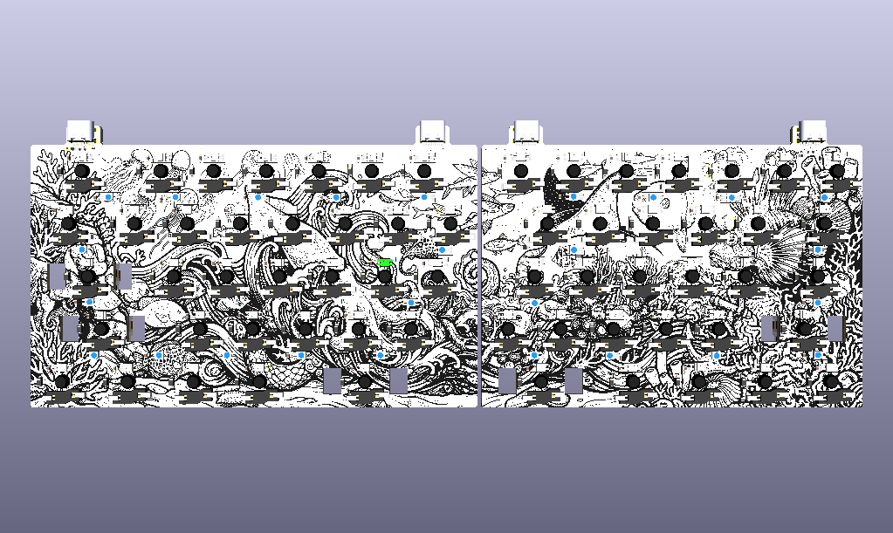

# umiko





A split, low-profile TKL F-row-less mechanical keyboard PCB. Two halves connect via USB-C, each half is independently powered and flashable, and each half has its own RP2040 microcontroller, per-key RGB, and underglow. Stabilizer cutouts are sized for Kailh Choc V2 stabilizers. Switches are Gateron KS-33 v2.0 low-profile (MX-compatible, hot-swap). 4-layer board with split L/R power rails and dedicated inner GND/3V3 planes.

## Features

* **Split layout** — two physically separate halves; each half has its own MCU and runs standalone
* **TKL, F-row-less** — full alpha + nav cluster on the right, no function row
* **Per-key RGB** (SK6812MINI-E reverse-mount, lights through PCB cutouts to underside of keycap)
* **Underglow** (SK6812MINI-E underglow variant, mounted on the back of the PCB)
* **Gateron KS-33 v2.0 low-profile hot-swap** switches (MX-compatible footprint, low-profile body)
* **Kailh Choc V2 stabilizers** (stabilizer cutouts on PCB sized for Choc V2, not MX stabs)
* **USB-C everywhere** — host USB-C per half + inter-half USB-C (replacing the older TRRS pattern)
* **RP2040** — one per half, each with its own external QSPI flash (W25Q128) and 3V3 LDO (LP5907)
* **BOOTSEL-only flashing** — each half has a BOOTSEL button (SW1 left, SW2 right). No reset circuit by design; flashing is via "unplug USB → hold BOOTSEL → plug USB → release → drop .uf2"
* **SWD test points** — 8 pads per half organized as a pogo-clip pattern (CLK/IO/GND/3V3); pads mirrored across halves so a flipped 6-pin clip lands on matching signals
* **4-layer PCB** with split L/R rails — F.Cu signal/copper, In1.Cu split 3V3 planes (L/R), In2.Cu split GND planes (L/R), B.Cu signal/copper
* **QMK firmware**

## Hardware Specs

| | |
|--|--|
| **MCU** | 2× Raspberry Pi RP2040 (QFN-56) |
| **Flash** | 2× Winbond W25Q128JVPIQ (16 MB QSPI) |
| **LDO** | 2× Texas Instruments LP5907 (3V3, X2SON-4) |
| **Crystal** | 2× 12 MHz (Crystal_SMD_2520-4Pin) |
| **USB ESD protection** | 2× USBLC6-2P6 |
| **Switches** | Gateron KS-33 v2.0 low-profile hot-swap (63 total) |
| **Stabilizers** | Kailh Choc V2 (2.25U and 2.75U key positions) |
| **Per-key RGB LEDs** | 63× SK6812MINI-E reverse-mount |
| **Underglow LEDs** | 26× SK6812MINI-E (B.Cu side) |
| **Host connector** | 2× HRO TYPE-C-31-M-12 (USB 2.0 16P) |
| **Inter-half connector** | 2× HRO TYPE-C-31-M-12 (used as 3-wire serial: VBUS, GND, D+) |
| **Diodes** | 63× SK matrix diodes, 4× power-path Schottky (PMEG2010BELD), 4× LED indicators |
| **Polyfuse** | 2× 500 mA (Fuse_0603) for USB power input |
| **Ferrite beads** | 2× 600 Ω (FB1/FB2) for VBUS filtering |

## BOM

Quantities are rounded up to account for spares — order more than the minimum.

Part | Part number | Qty | Notes / Source
--- | --- | --- | ---
RP2040 MCU | RP2040 (QFN-56) | 2 | Mouser / DigiKey / direct from Raspberry Pi
QSPI Flash | Winbond W25Q128JVPIQ | 2 | Mouser / DigiKey
3.3V LDO | TI LP5907SNX-3.3-NOPB | 2 | Mouser / DigiKey, X2SON-4
12 MHz crystal | 2520 4-pin SMD | 2 | LCSC / Mouser
USB-C receptacle | HRO TYPE-C-31-M-12 | 4 | LCSC, JLC, AliExpress
USB ESD | USBLC6-2P6 | 2 | SOT-666
Polyfuse | 500 mA 0603 | 2 | DigiKey / LCSC
Ferrite bead | 600 Ω 0402 | 2 | LCSC
Schottky diode | PMEG2010BELD (SOD-882) | 4 | LCSC / DigiKey
Per-key LEDs | SK6812MINI-E | 70+ | AliExpress / LCSC — order ~10% spare, these are fragile
Underglow LEDs | SK6812MINI-E | 30+ | Same as above; same part
Switch diodes | 1N4148WS / D3-SMD (SOD-323) | 70+ | LCSC / Mouser
Switches | Gateron KS-33 v2.0 low-profile | 63 | Keebio / Keychron / Gateron direct
Hot-swap sockets | Gateron KS33 hot-swap socket | 63 | Same source as switches
Stabilizers | Kailh Choc V2 (2u for 2.25U and 2.75U keys) | 2 sets | Choc V2 — **not** MX stabilizers
0603 100 nF ceramic caps | n/a | 90+ | LCSC / DigiKey
0402 caps (LDO bypass) | varies (see schematic) | as schematic | LCSC
0402 resistors | varies | as schematic | LCSC
BOOTSEL push button | 4×4×1.5 mm SMD | 2 | AliExpress / LCSC
0402 status LEDs | red / blue / green (per spec) | 4 | LCSC

## Software (QMK)

### Build

```
git clone https://github.com/idorurez/qmk_firmware.git
cd qmk_firmware
git submodule sync --recursive
git submodule update --init --recursive

# Compile left half
qmk compile -kb umiko -km default -bl uf2-split-left

# Compile right half
qmk compile -kb umiko -km default -bl uf2-split-right
```

### Flash

Each half is flashed independently via BOOTSEL:

1. **Unplug USB** from the half you want to flash
2. **Hold the BOOTSEL button** on that half (SW1 left, SW2 right)
3. **Plug USB back in** while holding BOOTSEL
4. **Release BOOTSEL** — the half mounts as a USB mass-storage device (RPI-RP2)
5. **Drag-and-drop the `.uf2`** for that half onto the drive — it auto-reboots into the new firmware

No reset button needed — power-cycle + BOOTSEL handles all flashing.

## Assembly Notes

### Soldering Order

1. **Smallest components first** — 0402 resistors/caps, then 0603, then SMD ICs
2. **MCUs (RP2040)** — these have an exposed thermal pad on the bottom that needs to be soldered (heat from below, use a hotplate or reflow station). Hand-soldering with a fine tip is doable but tricky.
3. **Flash chips, LDOs, ESD protection** — small SMD work
4. **Crystals** — fragile, place after the heavy soldering nearby is done
5. **USB-C receptacles** — mid-mount-ish; can be reflowed or hand-soldered
6. **LEDs** — start with underglow (back side), then per-key (front side). Test as you solder.
7. **Switch sockets** (Kailh / Gateron KS33 hot-swap) — last to give all-around access during earlier soldering
8. **Stabilizers** — clip in before testing switches
9. **Switches** — plug in last, after firmware flash works

### Soldering Hints

* For 0402 / 0603 SMD pads, **flux liberally** and keep your tip tinned with a fine bead of solder
* For Kailh / KS-33 hot-swap sockets, **pre-tin both pads**, then place the socket and reheat one pad at a time while pressing down
* For RP2040's exposed thermal pad, **use the via stitching as a heat sink** — solder paste + hot air, or paste + skillet reflow

### LEDs

* The **underglow LEDs are reverse-mounted on B.Cu** (back of board) — their pads are on B.Cu but the body sits below the PCB. **Bend the terminals down to the soldering pads** before reflowing or hand-soldering.
* **Solder LEDs in the data chain order** and **test as you go** — if one is bad, all LEDs after it in the chain won't light up
* If an LED looks broken or melted after soldering, it's probably broken — desolder and replace

### Stabilizers

The stabilizer cutouts on this PCB are sized for **Kailh Choc V2 stabilizers**. Standard MX / Cherry-style stabilizers **will not fit** the cutout. Stabilizers are needed at the 2.25U and 2.75U thumb keys.

### SWD Debug

If you need to flash via SWD (rare — BOOTSEL handles most needs):

* TP1-TP4 are SWD signals on the left half (CLK, IO) and right half (CLK, IO)
* TP5-TP8 are power references (GND_L, 3V3_L, GND_R, 3V3_R)
* All 8 pads are arranged in two mirrored 4-pad columns at 2.54 mm pitch (Adafruit pogo-clip 5433 compatible)
* Pad order on left is top-to-bottom: **CLK / IO / GND / 3V3**
* Pad order on right is mirrored: **3V3 / GND / IO / CLK** — so a flipped pogo clip lands on matching signals on both halves

## Design Notes

* **No reset circuit** — flashing is via BOOTSEL alone. RP2040's `~RUN` pin has an internal pull-up; leaving it floating is safe.
* **Inter-half connection** uses USB-C for the physical connector but carries QMK split-serial protocol (single data wire on D+, with GND and VBUS sharing power). Not a real USB connection between halves.
* **Each half is fully independent** — you can power and flash each half on its own. Either half can be the master.
* **Edge cuts** have 1.25 mm fillets on all corners. Both halves form closed loops; no breakaway tabs (order as 2 separate boards, or as a customer panel).
* The `onigaku` repo (sibling library) contains the custom symbols, footprints, and 3D models referenced by this design. Must be cloned alongside this repo for KiCad to find the libraries.

## Stretch / Future Ideas (Rev 2)

* Build a matching case (likely integrated-plate style given the low-profile switches — see design notes)
* Build a plate (Kailh Choc V2 plate cutouts)
* OLED breakout board for SSD1306 / SH1106 (the inter-half I²C lines `SCL_*` / `SDA_*` are currently broken out but unwired)
* Sound and speakers (piezo or similar)
* Optional reset buttons per half (in case BOOTSEL alone proves too cumbersome)

## Inspiration

This design borrows ideas from:

* [Corne (CRKBD)](https://github.com/foostan/crkbd) — split design pattern, reverse-mount LED approach
* Corne Waffle — bottom-row layout study
* marvelous65 split — TKL split with separate inter-half data path
* ganymede — case style
* [0xCB-Helios](https://github.com/0xCB-dev/0xCB-Helios) — schematic patterns for RP2040 + dual flash + LDO

## Credits

QMK community help (without their patience this wouldn't exist):

* drashna
* foostan
* waffle
* tzarc
* xyz

## License

PCB files: CERN OHL v2 — Permissive (or your preferred license; verify before forking).
Firmware: GPL-2.0 (inherited from QMK).
