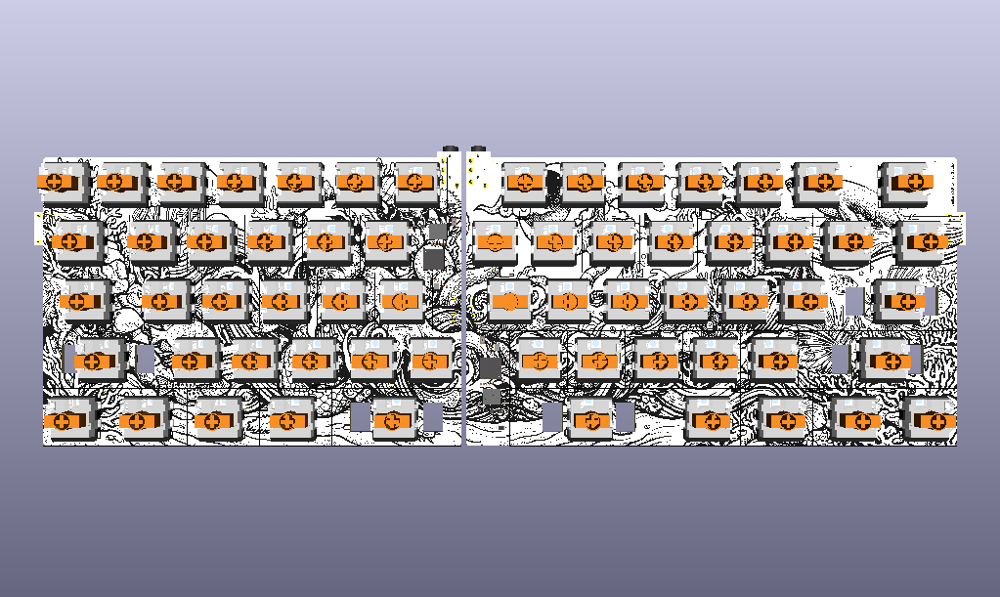
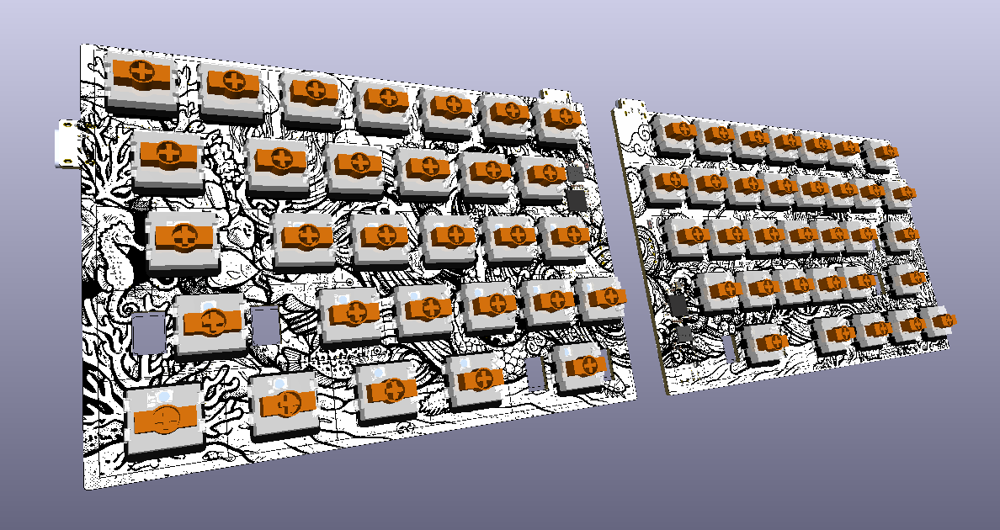
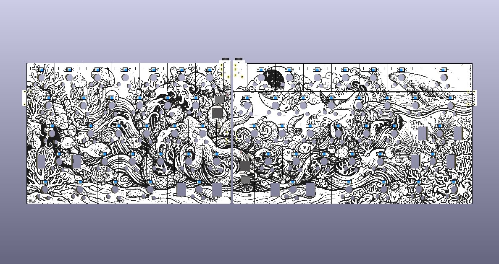
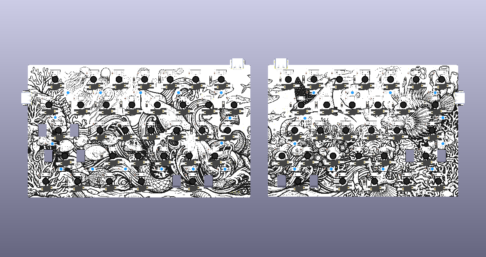
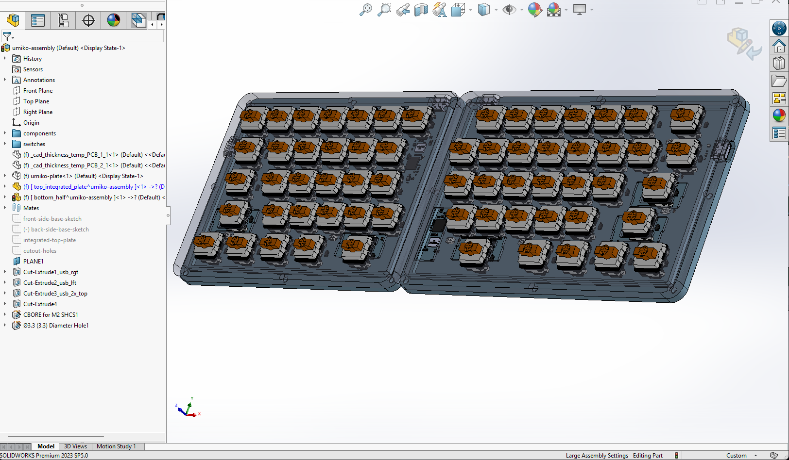

# umiko

## About

*umiko* (Japanese: **海** sea + **子** an affectionate diminutive) is a split, low-profile TKL F-row-less mechanical keyboard PCB. The split sits between your hands like the trough between two waves; typed at speed on Gateron KS-33 low-profile blues, the rolling clicks sound like waves breaking on sand.



## Features

* **Split layout** — two physically separate halves; each half has its own MCU and runs standalone
* **TKL, F-row-less** — full alpha + nav cluster on the right, no function row
* **Per-key RGB** (SK6812MINI-E reverse-mount, lights through PCB cutouts to underside of keycap)
* **Underglow** (SK6812MINI-E underglow variant, mounted on the back of the PCB)
* **Gateron KS-33 v2.0 low-profile hot-swap** switches (MX-compatible footprint, low-profile body)
* **Kailh Choc V2 stabilizers** (stabilizer cutouts on PCB sized for Choc V2, not MX stabs)
* **Side-mounted host USB-C** per half (on the outer edge of each board) for host connection and power
* **Top-mounted USB-C inter-half link** (HRO Type-C, on the top edge of each board near the inner-top corner) carrying single-wire PIO serial (over D+), GND, and 5 V bridge between halves
* **RP2040** — one per half, each with its own external QSPI flash (W25Q128) and 3V3 LDO (LP5907)
* **BOOTSEL-only flashing** — each half has a BOOTSEL button (SW1 left, SW2 right). No reset circuit by design; flashing is via "unplug USB → hold BOOTSEL → plug USB → release → drop .uf2"
* **SWD test points** — 8 pads per half organized as a pogo-clip pattern (CLK/IO/GND/3V3); pads mirrored across halves so a flipped 6-pin clip lands on matching signals
* **4-layer PCB** with split L/R rails — F.Cu signal/copper, In1.Cu split 3V3 planes (L/R), In2.Cu split GND planes (L/R), B.Cu signal/copper
* **QMK firmware**

## Hardware Specs

| | |
|--|--|
| **Dimensions** | 328.62 × 102.85 mm (end-to-end, both halves + 13.11 mm inter-half gap). Left half 145.67 × 102.85 mm, right half 169.84 × 102.85 mm. |
| **MCU** | 2× Raspberry Pi RP2040 (QFN-56) |
| **Flash** | 2× Winbond W25Q128JVPIQ (16 MB QSPI) |
| **LDO** | 2× TI LP5907SNX-3.3 (XDFN-4, 250 mA) |
| **Crystal** | 2× 12 MHz (Crystal_SMD_2520-4Pin) |
| **Switches** | 63× Gateron KS-33 v2.0 low-profile (MX-compatible, hot-swap) |
| **Stabilizers** | Kailh Choc V2 (2.25U + 2.75U + 2U backspace) |
| **RGB LEDs** | 63× per-key + 27× underglow (both SK6812MINI-E) |
| **Host USB-C** | 2× HRO TYPE-C-31-M-12 (side-mounted, outer edge, 4 mm plank protrusion + 1 mm connector overhang) |
| **Inter-half USB-C** | 2× HRO TYPE-C-31-M-12 (top-edge mounted, near inner-top corner). Carries VBUS (+5V bridge), GND, and single-wire PIO serial on D+. |
| **Case hardware** | M2 × L4 × D3.5 heat-set inserts (3.3 mm holes) + M2 × 4 mm screws. |

Full sourcing detail in the [BOM](#bom).



## BOM

Quantities are rounded up to account for spares — order more than the minimum.

Part | Part number | Qty | Notes / Source
--- | --- | --- | ---
RP2040 MCU | RP2040 (QFN-56) | 2 | LCSC `C2040` / Mouser / DigiKey / direct from Raspberry Pi
QSPI Flash | Winbond W25Q128JVPIQ | 2 | LCSC `C190862` / Mouser / DigiKey
3.3V LDO | TI LP5907SNX-3.3 | 2 | LCSC `C133572` (XDFN-4, 1×1 mm) — 250 mA / 3.3 V. See [LDO history note](#ldo-history) below for why this instead of the Helios-spec'd TLV75533.
12 MHz crystal | 2520 4-pin SMD | 2 | LCSC `C2149204` / Mouser
USB-C receptacle (host + inter-half) | HRO TYPE-C-31-M-12 | 4 | LCSC `C165948` / JLC / AliExpress — same part used for all four positions (J1/J2 outer = host, J3/J4 top = inter-half)
USB ESD | USBLC6-2P6 | 2 | LCSC `C2827693` (SOT-666)
Polyfuse | Bourns MF-FSMF050X-2 (500 mA hold / 1 A trip, 0603) | 2 | LCSC `C210357` / DigiKey (per Helios reference design)
Ferrite bead | 600 Ω 0402 | 2 | LCSC `C160977`
Schottky diode | PMEG2010BELD (SOD-882) | 4 | LCSC `C552820` / DigiKey
Per-key LEDs | SK6812MINI-E (reverse mount) | 70+ | LCSC `C5149201` / AliExpress — order ~10% spare, fragile. Pin **numbers** between vendors differ but physical VDD/VSS/DIN/DOUT corners match
Underglow LEDs | SK6812MINI-E | 30+ | Same as above; same part (`C5149201`)
Switch diodes | 1N4148W (SOD-123) | 70+ | LCSC `C81598` / Mouser. Footprint `onigaku:D3_SMD_v2` is SOD-123, **not** SOD-323
Switches | Gateron KS-33 v2.0 low-profile | 63 | Keebio / Keychron / Gateron direct (hand-place; not from JLC stock)
Hot-swap sockets | Gateron KS33 hot-swap socket | 63 | Same source as switches
Stabilizers | Kailh Choc V2 (2u for 2.25U, 2.75U, and 2U keys) | 2 sets | Choc V2 — **not** MX. Kailh has EOL'd this part — stock spares while retailers still have them. See [Stabilizers](#stabilizers) for the full story.
0603 100 nF ceramic caps | CC0603KRX7R9BB104 (or equiv 0.1µF X7R) | 90+ | LCSC auto-matches — confirm prompt is benign
0402 caps (LDO bypass) | varies (see schematic) | as schematic | LCSC `C1525` / `C15525` / `C52923` etc.
0402 resistors | varies | as schematic | LCSC `C25905` (5.1k, UNI-ROYAL) / `C11702` (1k, UNI-ROYAL) / `C60490` (10k, YAGEO) / `C138021` (27R, YAGEO) / `C25900` (4.7k, UNI-ROYAL) — 10k and 27R switched from UNI-ROYAL to YAGEO after recurring JLC stock shortages on UNI-ROYAL 0402 SKUs; the R30/R31 4.7k previously carried the 5.1k `C25905` code by mistake and is now correct
BOOTSEL push button | 4×4×1.5 mm SMD | 2 | LCSC `C589221`
0402 status LEDs | red / blue / green (per spec) | 4 | LCSC `C130719` / `C130724`
Case heat-set inserts | M2 × L4 × D3.5 brass knurled | as case dictates | Ruthex-style or equivalent — Amazon / AliExpress. Print 3.3 mm holes; heat-install with soldering iron ~200°C
Case screws | M2 × 4 mm machine screws | same qty as heat-set inserts | Any standard M2 × 4 — hardware store / Amazon / AliExpress
Rubber feet (sticky) | Adhesive-backed rubber pads | 4–8 per half | Sized to fit the recesses on the case bottom. Any standard "keyboard foot" or "furniture bumper" pack works — Amazon / AliExpress

## Software (QMK)

### Where the keyboard config lives

The umiko QMK keyboard definition lives in a **fresh clone of upstream QMK**, not in the older `idorurez/qmk_firmware` fork (which is on the `bakekujira` branch and carries stale history for an unrelated older board). Clean-slate approach:

```
git clone --depth 1 https://github.com/qmk/qmk_firmware.git ~/dev/keyboard/qmk_umiko
cd ~/dev/keyboard/qmk_umiko
git submodule update --init --recursive   # ~2 GB, ~10 min. Required for RP2040 (pico-sdk submodule)
```

The `keyboards/umiko/` folder is authored by-hand in this repo. Files: `info.json` (matrix pins, 5×8 scanning matrix, split serial vendor driver on GP0, LAYOUT_all with 63 keys extracted from the schematic), `rules.mk`, `config.h`, `keymaps/default/keymap.c`, `readme.md`. Copy these into `qmk_umiko/keyboards/umiko/` when setting up a fresh clone. (TODO: move keyboards/umiko/ into this repo and symlink or use QMK's external-keyboard support so it lives with the PCB source.)

### Toolchain (Windows)

QMK's CLI requires MSYS2 on Windows (its `MSYSTEM` environment check hard-fails in git-bash or plain shells).

**One-time setup**: [docs/toolchain-windows.md](docs/toolchain-windows.md) — exact MSYS2 install, pacman packages, QMK CLI pip, junction. Covers the Windows gotchas the QMK docs miss (jsonschema/rpds-py, `USERPROFILE`, `keyboard.json` vs `info.json`).

**Compile** (after setup):

| Script | What it does |
|---|---|
| `scripts/qmk_compile.sh [keymap]` | Wraps `qmk compile -kb umiko -km <keymap>` inside MSYS2 with all the required env vars (USERPROFILE, HOME, PATH). Defaults to `default` keymap. Output UF2 lands at `qmk_umiko/umiko_default.uf2` (~74 KB). |

### QMK config: `keyboard.json` (NOT `info.json`)

Current QMK expects each keyboard folder to have `keyboard.json` at the top level (the old `info.json` name causes `qmk compile -kb umiko` to fail with `invalid keyboard_folder value`). Umiko's config is at `qmk_umiko/keyboards/umiko/keyboard.json`.

### Split handedness

Umiko has no dedicated handedness pin (`SPLIT_HAND_PIN`), so the default UF2 relies on QMK's USB-detect-based master election (whichever half enumerates as a USB HID device becomes master; the other becomes slave over the inter-half serial link). This may need tweaking if it doesn't behave — options include compile-time `MASTER_LEFT`/`MASTER_RIGHT` defines or `EE_HANDS` (per-half EEPROM handedness). TODO: revisit after first split test.

### Flash

Each half is flashed independently via BOOTSEL:

1. **Unplug USB** from the half you want to flash
2. **Hold the BOOTSEL button** on that half (SW1 left, SW2 right)
3. **Plug USB back in** while holding BOOTSEL
4. **Release BOOTSEL** — the half mounts as a USB mass-storage device (RPI-RP2)
5. **Drag-and-drop the `.uf2`** for that half onto the drive — it auto-reboots into the new firmware

Note: on this board the W25Q128 flash arrives blank from JLC, so first plug-in enters BOOTSEL automatically (RP2040 defaults to USB mass-storage mode when the QSPI flash contains no valid firmware). After first flash, subsequent re-flashes need the BOOTSEL button held.

No reset button on the board — power-cycle + BOOTSEL handles all flashing. Case access to SW1/SW2 is a design decision left to the case (v1 uses pinhole access; v2 plans to integrate the buttons directly — see [Rev 2 ideas](#stretch--future-ideas-rev-2)).

### Split serial: what's happening on the wire

Umiko routes QMK's split-transport protocol over a **single-wire half-duplex PIO serial** running on **GP0** of each RP2040. GP0 connects to the D+ pin of each half's inter-half USB-C connector (J3 left, J4 right). A short USB-C-to-USB-C cable between J3 and J4 ties the two GP0 lines together and provides the 5V bridge (VBUS pins A4/A9) and GND (A12/B12).

QMK config:
- `info.json` → `split.serial.driver = "vendor"` (uses RP2040 PIO peripheral for the serial protocol)
- `config.h` → `SERIAL_USART_TX_PIN = GP0` (single pin used for both TX and RX in half-duplex)

The inter-half USB-C is **not** a real USB port — it's just a convenient 4-conductor connector shape (VBUS + GND + D+). Do not plug either J3 or J4 into a computer or USB device.

## Assembly Notes



> ⚠️ **Hand-solder only the DNP parts. Get everything else JLCPCB-assembled.**
>
> **✅ Reasonable to hand-solder** (these are already DNP'd for exactly this reason):
> * **SK6812MINI-E LEDs** — per-key (reverse-mount) and underglow. Fragile and tedious but doable with flux and patience.
> * **Gateron KS33 hot-swap sockets** — pre-tin the pads, place, reflow one pad at a time. Straightforward.
> * **HRO TYPE-C-31-M-12 USB-C connectors** — larger through-hole shield legs + reflowable SMD data pads. Manageable with a chisel tip.
>
> **❌ Do NOT attempt to hand-solder** (unless you're a professional with a reflow / hotplate / hot-air station):
> * **RP2040 (QFN-56 with exposed thermal pad)** — needs bottom heat. Ruining a $30 chip is very possible.
> * **LP5907 LDO (XDFN-4, 1×1 mm)** and **SN74LVC1T45 (SOT-563)** — pads so small they're barely visible without magnification.
> * **W25Q128 QSPI flash (WSON8)** — exposed pad on the bottom.
> * **USBLC6-2P6 (SOT-666)**, **PMEG2010BELD Schottky (SOD-882)** — sub-millimeter pitch.
> * **0402 passives, matrix diodes (SOD-123), crystal (SMD-2520)** — 0402 in particular is 90+ tiny caps that add up.
>
> **Get JLCPCB to place the "do NOT" list** via SMT assembly — see [Manufacturing Notes (JLCPCB)](#manufacturing-notes-jlcpcb) for the fab workflow, cost, and DNP configuration. Then do the ✅ list yourself when the boards come back.
>
> The Soldering Order / Hints / LEDs / Stabilizers sections below are for that hand-solder pass on the DNP parts (plus small rework as needed).

### Soldering Order

1. **Smallest components first** — 0402 resistors/caps, then 0603, then SMD ICs
2. **MCUs (RP2040)** — these have an exposed thermal pad on the bottom that needs to be soldered (heat from below, use a hotplate or reflow station). Hand-soldering with a fine tip is doable but tricky.
3. **Flash chips, LDOs, ESD protection** — small SMD work
4. **Crystals** — fragile, place after the heavy soldering nearby is done
5. **USB-C receptacles** (HRO TYPE-C-31-M-12) — SMD signal pads + 4 THT shield legs + 2 NPTH alignment pegs; body sits on top of the PCB. Can be reflowed or hand-soldered.
6. **LEDs** — start with underglow (back side), then per-key (front side). Test as you solder.
7. **Switch sockets** (Kailh / Gateron KS33 hot-swap) — last to give all-around access during earlier soldering
8. **Stabilizers** — clip in before testing switches
9. **Switches** — plug in last, after firmware flash works

### Soldering Hints

* For 0402 / 0603 SMD pads, **flux liberally** and keep your tip tinned with a fine bead of solder
* For Kailh / KS-33 hot-swap sockets, **pre-tin both pads**, then place the socket and reheat one pad at a time while pressing down
* For RP2040's exposed thermal pad, **use the via stitching as a heat sink** — solder paste + hot air, or paste + skillet reflow

### LEDs



* The **underglow LEDs are reverse-mounted on B.Cu** (back of board) — their pads are on B.Cu but the body sits below the PCB. **Bend the terminals down to the soldering pads** before reflowing or hand-soldering.
* **Solder LEDs in the data chain order** and **test as you go** — if one is bad, all LEDs after it in the chain won't light up
* If an LED looks broken or melted after soldering, it's probably broken — desolder and replace

### Stabilizers

**Kailh Choc V2 stabilizers** on all 6 stabbed positions (2.25U shifts + 2.75U thumbs + 2U backspace). Standard MX stabs won't fit. Kailh **EOL'd this part in 2026** — stock spares from retailer inventory while it lasts.

**Not Gateron LP** — per bakingpy (Keebio, author of `keebio/kb-plategen`): Gateron LP stabs mechanically limit switch travel so keys don't bottom out fully; no cutout tweak fixes it.

**Plate design**: 2.2 mm plate, stepped pocket per stab position (1.2 mm housing pocket on top, 1.0 mm wire clearance on bottom). Reference: [`reference/choc_v2_stab_holder.stl`](reference/choc_v2_stab_holder.stl). **Printed in PETG with no tolerance adjustments needed**; other FDM materials may need outward relief on the far-from-switch faces (never widen inward, plate breaks during install).

Cutout dimensions (from `keebio/kb-plategen`, encoded in `scripts/make_plate.py`): Body A 5.95×7.95 mm at (±12, ±0.3441), Neck B 4.55×6.25 mm at (±12, ±6.7559), Wire slot 24×1.4 mm at (0, ±8.2809), r=0.5 mm fillet unioned per stab. Sign flips for SW_30/SW_35 (bottom-edge keys → wire points north).

### SWD Debug

If you need to flash via SWD (rare — BOOTSEL handles most needs):

* TP1-TP4 are SWD signals on the left half (CLK, IO) and right half (CLK, IO)
* TP5-TP8 are power references (GND_L, 3V3_L, GND_R, 3V3_R)
* All 8 pads are arranged in two mirrored 4-pad columns at 2.54 mm pitch (Adafruit pogo-clip 5433 compatible)
* Pad order on left is top-to-bottom: **CLK / IO / GND / 3V3**
* Pad order on right is mirrored: **3V3 / GND / IO / CLK** — so a flipped pogo clip lands on matching signals on both halves

## Manufacturing Notes (JLCPCB)

### Cost reference

Two reference points from actual orders:

* **First-time full-panel build** (both halves per board, 5-board fab minimum with parts placed on 3 = 3 assembled + 2 bare spares): **~$489**
* **Right-half-only respin** (170 × 103 mm single-half, 5-board fab minimum with parts on 3): **~$300**

A first-time builder needs the full-panel order (~$489). The respin was cheaper because I already had working left halves from the first order and only needed the right half re-fabbed with a schematic fix.

Rough breakdown at those volumes:

* PCB fab (5 pcs, 4-layer, 328 × 103 mm full-panel or 170 × 103 mm half): ~$50–100
* PCBA labor + parts sourcing (3 boards): ~$200–300
* Express shipping to US (only option that clears in reasonable time): ~$80
* Customs / import handling: ~$50–100 (varies by broker)

Ordering 5 assembled vs 3 usually adds only ~$50–100 total because setup and per-part sourcing fees amortize. If you want spares, 5 fully assembled is barely more per board than 3.

### Design rule clearances

This board is set up for **JLCPCB's standard 4-layer pricing tier**:

* **Minimum clearance**: 0.1 mm (4 mil) — JLC's standard min for 4-layer at no surcharge
* **Net class clearance**: 0.1 mm
* **Track widths**: 0.2 mm (signals), 0.3 mm (power/GND) — well above the 0.1 mm minimum
* **Min via**: 0.4 mm diameter / 0.2 mm drill
* **Min hole**: 0.3 mm (matches JLC standard)

If you want **tighter clearances** (down to 0.089 mm / 3.5 mil), JLC will accept the files but add a **+20% surcharge** on 4-8 layer boards.

### JLC fab options used for this design

* **Layers**: 4
* **Different Design in Panel**: 2 (left and right halves are separate outlines)
* **Min hole size**: 0.3 mm
* **Min track/spacing**: 5/5 mil (well within standard)
* **Outer copper**: 1 oz
* **Inner copper**: 0.5 oz (default for 4-layer)

### Fab file generation

| Script | What it does |
|---|---|
| `scripts/make_jlc_files.py` | Reads the schematic + PCB (read-only) and writes 3 JLC-upload-ready files to `fab/`: gerbers zip, BOM CSV, CPL CSV — all in JLC's exact required format (specific headers, 4-decimal mm-suffixed coords, integer rotations, DNP filter, LCSC overrides). Regenerate any time. |

Outputs in `fab/`:

| File | Purpose |
|---|---|
| `umiko-jlc-gerbers.zip` | Gerbers + Excellon drill files — the fab upload |
| `umiko-bom-jlc.csv` | BOM in JLC format (header uses fullwidth Chinese parens; ref ranges expanded; DNP rows filtered out) |
| `umiko-cpl.csv` | Placement (Designator, Mid X/Y with `mm` suffix at 4-decimal precision, capitalized Top/Bottom, integer rotation 0–359) |

**DNP list** (excluded from both BOM and CPL — hand-soldered later):

* `YS-SK6812MINI-E` (90 total) — per-key are reverse-mount (not standard PnP); underglow OPSCO layout is 180° from our footprint. Both hand-soldered.
* `KEYSW` (63) — Gateron KS-33 hot-swap sockets, not in JLC's stock. Sourced from Keebio / Gateron / AliExpress.

**LCSC overrides** (baked into the script for parts whose schematic symbols don't carry an LCSC field): matrix diode `D3_SMD_v2` → `C81598`, per-key + underglow LED `YS-SK6812MINI-E` → `C5149201`.

### CAD exports (case / plate design)

| Script | What it does |
|---|---|
| `scripts/make_cad_files.py` | 3D STEP exports of the whole board + component groups (assembly, halves, switches, LEDs, ICs, connectors, passives) for case CAD import into SolidWorks. Read-only on the source PCB — uses an in-memory copy + self-deleting temp file. |
| `scripts/make_plate.py` | Plate STEP + DXF for the case top plate (integrated switch cutouts + Choc V2 stab cutouts). Optional CLI arg to also generate a "switches-only" alt plate with configurable switch cutout size (`14.2 14.0` recommended for FDM). Read-only on the source PCB. |

Outputs in `cad/`:

| File | Purpose |
|---|---|
| `umiko-assembly.step` | Full board + all components |
| `umiko-half-{left,right}.step` | Split into just one half |
| `umiko-{switches,leds,ics,connectors,passives,board}.step` | Component-group subsets |
| `umiko-plate.step` / `.dxf` | Plate with switch + stab cutouts (canonical Choc V2 spec) |
| `umiko-switches-only[-WxH].step` / `.dxf` | Alt plate with just switch cutouts at custom size |

**Key numbers**:

* **Board thickness**: 1.6 mm (JLC standard, ±10% — plan case pocket for up to 1.76 mm).
* **Plate thickness**: **2.2 mm total** (bakingpy two-level design), split as **1.2 mm housing pocket on top** (Choc V2 clip engagement depth) + **1.0 mm wire clearance pocket on bottom** — see [Stabilizers](#stabilizers).
* **Switch bodies render on F.Cu; hot-swap sockets on B.Cu.** Switch *footprints* are on B.Cu (socket pads live there) but the switch *bodies* still show on F.Cu.
* **STEP thickness compensation**: KiCad's exporter omits outer copper (~0.07 mm) + soldermask (~0.02 mm), so both scripts bump the extruded thickness by **+0.09 mm** to hit a true 1.6 mm / 1.2 mm. F.Cu components ride up automatically; switch bodies (anchored to B.Cu sockets) get an extra `-4.1 → -4.19` 3D-model offset nudge to stay flush.
* **PLA case FDM clearance**: **0.5 mm/side long axis, 0.3 mm/side short axis, 0.2 mm Z**. Print tolerance dominates over PLA shrinkage / thermal. Test a corner chunk and tune slicer XY size compensation before a full-case print.



#### Workflow suggestion (case design) 

The following workflow is if you would prefer to build your own case. The included case design is fully complete. If you wish to build your own, it also doubles as a base starting point.

1. Run `python scripts/make_cad_files.py` and `python scripts/make_plate.py` once to seed `cad/` with the STEPs.
2. In SolidWorks, import `umiko-assembly.step` (or per-half if you're working on one side) as reference geometry, mate to case origin.
3. Design the case around it — pocket the PCB, add USB-C cutouts, screw holes, feet, BOOTSEL access at SW1 (166.01, 57.53) and SW2 (188.17, 77.52). v1 uses pinholes; v2 plans a case-integrated button — see [Rev 2 ideas](#stretch--future-ideas-rev-2).
4. For the plate: import `umiko-plate.step` or build a subtract body from `umiko-switches-only.step` (see [SolidWorks "Combine → Subtract" trick](#).
5. Freeze the STEPs once case work starts — see warning below.
6. Track your working SW files under `cad/` in git — everything else in that folder is regenerable.

> ⚠️ **Warning: don't re-import STEPs into an active case assembly.**
>
> Any PCB change followed by a fresh STEP export and re-import into your existing SolidWorks case will **almost certainly break downstream in-context references** — sketches that used Convert Entities on imported edges/faces will show as dangling, features that depended on those sketches will fail, and repairing them one by one is slow and error-prone (SW 2023's "Repair Dangling Reference" doesn't reliably help). Cause: STEP entity IDs shift whenever the source PCB geometry changes even slightly. Every recompile issues fresh IDs; SW's references are ID-based.
>
> **Rule of thumb**: re-run the scripts only when the PCB *actually* changes AND you need the case CAD to reflect it visually. If you can live with a slightly stale reference PCB in your case model, you save yourself hours of repair work. The fab side is unaffected either way — `scripts/make_jlc_files.py` reads the current PCB directly.
>
> **If you must re-import, isolate the update.** `make_cad_files.py` writes per-group STEPs (`umiko-switches.step`, `umiko-leds.step`, `umiko-connectors.step`, `umiko-ics.step`, `umiko-passives.step`, `umiko-board.step`) — swap only the subset your change actually touched (e.g. re-import just `umiko-switches.step` if you moved a switch, not the whole assembly). Damage stays contained to references that used that specific subset. And still work on a **copy** of the case assembly first as a safety net.

### JLC upload gotcha

**Updates to BOM or CPL won't apply unless you restart the upload from the project menu.** Re-uploading just the BOM/CPL after a failed attempt will appear to succeed but JLC keeps the prior validation state, leading to errors like "Failed processing the CPL file" or "BOM doesn't match CPL" that don't actually correspond to the current file contents. The fix is to back up to the **PCB quote** step in JLC's flow and start the whole upload over (gerbers → BOM → CPL).

### CPL format quirks (learned the hard way)

JLC's CPL parser is unusually strict about:

* **Rotation must be a non-negative integer 0–359** — KiCad's default `-90.000000` will be rejected with "Failed processing the CPL file". `make_jlc_files.py` normalizes to integer mod 360.
* **Coordinates must be fixed at 4-decimal precision** — variable precision like `8.647045mm` also fails. The script formats with `.4f`.
* **Headers must match JLC's sample exactly**, including the fullwidth Chinese parens in the BOM's `JLCPCB Part #（optional）`.

### Polarity / pin-1 review from JLC (expect these questions)

During engineering review JLC's team sends placement snapshots highlighted with a **pink dot on pin 1** of every polarized (or asymmetric) component and asks you to confirm the orientation matches your intent. This isn't optional — you have to respond one by one. A few patterns from this project's reviews worth banking:

* **Non-polarized parts don't need rotation review, but JLC still marks pin 1.** For **polyfuses (F1/F2, Bourns MF-FSMF050X-2)**, **ceramic capacitors**, and **resistors** the pink dot is a manufacturing / QA marker, not an electrical polarity flag. Reply "no polarity, either orientation works, no correction needed" — the notch or dot on the physical part is a tracking mark from the reel, not an electrical constraint. Same for **ferrite beads**.
* **Polarized parts need per-part verification against your KiCad footprint.** Diodes (Schottky **D5** power-path), LEDs (**D2/D4/D6** indicator, plus every SK6812MINI-E in the underglow chain), electrolytic caps if any, and orientation-sensitive ICs (RP2040, LDO, USBLC6, level shifter) all have a specific pin-1 convention on your PCB. Check JLC's placement direction against your KiCad footprint's pin-1 assignment; if they're flipped 180°, request a rotation correction.
* **Different LCSC part numbers for the "same" LED footprint can use opposite pin-1 conventions.** On this project **D4** (`C130724`, Sunny B1811NB) uses **anode = pin 1** while **D6** (`C130719`, Sunny B1811URO) uses **cathode = pin 1** — same 0402 SMD LED footprint, opposite convention. JLC's pink dot points at whichever pin their library considers 1, which doesn't match the KiCad footprint (pin 1 = cathode) for D4. Result: D4 required a **180° rotation correction**, D6 did not. Expect to hit this on any 0402 LED order and check each part individually.
* **How to answer "is the polarity right?" from JLC:** open the PCB in KiCad, click the flagged pad, note whether pin 1 is anode/cathode (or SDA/SCL, etc.) and which side of the physical part it lands on after any footprint rotation. Compare to JLC's placement snapshot. If the pink dot lands on the electrically-correct side per your schematic → confirm no correction. If it's on the opposite side → request 180° rotation. Also useful to check `pinfunction` fields in `umiko.kicad_pcb` — they carry the intended electrical role (`K_1`, `A_2`, `SDA_1`, etc.).
* **Rotation corrections that recur across orders** and are worth including proactively in the reply to JLC:
    * **U10** (LP5907 LDO, X2SON-4): **+90°**
    * **D5** (PMEG2010BELD Schottky, SOD-882D): **180°** — JLC's default library orientation places D5 reversed from the KiCad footprint's cathode-on-+5V_R intent. Verified empirically: on the right-only-respin order, we requested the 180° correction but JLC didn't apply it, and all 3 boards had D5 blocking the J2 host USB power path. **After submitting the correction, always verify JLC's engineering-review 3D preview shows D5 with the cathode band on TOP (toward +5V_R rail), not bottom, before signing off.**
    * **J2/J4** (HRO USB-C, if their 3D preview shows them backwards): **180°**
    * **D4** (Sunny B1811NB User LED): **180°**
    * **D6** (Sunny B1811URO Power LED): **NO correction** (already correct)
    * **U6, U8, U9**: **270°** (documented in schematic `JLCPCB_CORRECTION` field, JLC usually applies proactively)

Send those with your BOM upload so their engineers can apply them up front instead of asking one at a time.

## Design Notes


* **No reset circuit** — flashing is via BOOTSEL alone. RP2040's `~RUN` pin has an internal pull-up; leaving it floating is safe.
* **Inter-half connection** uses **USB-C (HRO TYPE-C-31-M-12, top-edge mounted)** carrying QMK PIO-serial split over a **single wire on D+** (A6/B6 are tied together, A7/B7 D− unused). VBUS (A4/A9) bridges 5 V across halves, GND (A12/B12) ties them. The 5 V bridge lets a single host USB-C power both halves through Schottky OR-ing. All four USB-C connectors — J1/J2 (host) and J3/J4 (inter-half) — have 5.1 kΩ CC1/CC2 pull-downs to GND (host J1=R4/R5, host J2=R21/R22, inter-half J3=R6/R24, inter-half J4=R25/R26). J3/J4 don't strictly need CC pull-downs for the serial-bridge use case (the link doesn't speak USB protocol), but they're populated as a safety-conservative choice so an accidentally-plugged host cable can't drive VCONN into a floating pin.
* **Inter-half data is single-wire, not differential** — D+ carries half-duplex 12 MHz PIO serial; D− is intentionally floating. This is the same pattern as TRRS-based RING1 splits, just routed through USB-C-shaped pins. The connector is **not** an actual USB device port and should not be addressed as one in firmware.
* **Connector placement** — the two host USB-C jacks (J1/J2) are mounted on the outer-side edges of each half (aligned with the Q-row keycap top); the inter-half USB-C jacks (J3/J4) are on the **top edge** of each half, near the inner-top corner, so a short USB-C-to-USB-C cable bridges between them across the keyboard's top edge with minimal slack. All four USB-C connectors sit on Edge.Cuts plank protrusions of **4 mm** (with the connector's plug face overhanging the plank by **1 mm**, giving a clean 1 mm recess inside a planned 6 mm case wall).
* **Each half is fully independent** — you can power and flash each half on its own. Either half can be the master.
* **Edge cuts** have 1.25 mm fillets on all corners. Both halves form closed loops; no breakaway tabs (order as 2 separate boards, or as a customer panel).
* The `onigaku` repo (sibling library) contains the custom symbols, footprints, and 3D models referenced by this design. Must be cloned alongside this repo for KiCad to find the libraries.

### LDO history

U2/U10 use **LP5907SNX-3.3** (TI, XDFN-4, LCSC `C133572`, 250 mA) — a pin-compatible substitute for the 0xCB Helios reference `TLV75533PDQNR` (X2SON-4, 500 mA, LCSC `C2861882`) after JLC/LCSC ran out of X2SON stock through 2025–2026. Symbol/footprint stayed the same; only the placed chip changed.

**250 mA is enough**: per-half 3.3 V load is ~150 mA peak (RP2040 ~50 mA + flash ~15 mA + OLED ~20 mA + LEDs/biases). Per-key RGB runs off VBUS 5 V, not this rail.

**If a future rev needs 500 mA** (Bluetooth, bigger display, expansion headers): `TLV75533PDQNR` drops into the current footprint if JLC restocks; `TLV75533PDBVR` (SOT-23-5, LCSC `C404027`) is more reliably stocked but requires a footprint + symbol swap (5-pin: pad 5 = OUT, pad 4 = NR).

## Stretch / Future Ideas (Rev 2)

* **Bigger, case-integrated BOOTSEL button per half** — v1 uses tiny 4×4×1.5 mm SMD tacts (SW1/SW2) requiring a pinhole in the case top for paperclip access. v2 should either (a) swap the PCB switch to a **larger through-hole or lower-mount tactile** so a case-integrated **cantilever / living-hinge button** (3D-printed flexure that presses the PCB switch when pushed from outside) works cleanly, or (b) go directly to a case-integrated button style with the tact positioned to sit under the flexure.
* **Lower-profile OLED mounting** — current through-hole 4-pin header puts the daughterboard ~10–12 mm above the PCB, forcing the case cutout to swallow the whole board (not just the display window). Options: short-body SMD headers (~3–5 mm mated), board-to-board connectors (Hirose DF13 / JAE FI-X, ~2–4 mm), or a direct SMD OLED module (eliminates the daughterboard entirely).
* **OLED breakout board** for the inter-half I²C lines (`SCL_*` / `SDA_*` are broken out but unwired).
* **Sound** — small speaker + amp (e.g. PAM8302 mono class-D) + audio storage/playback path. A dedicated audio DAC or a codec IC with I²S from the RP2040 can play short WAV/MP3 clips off an SD card or an extra flash chip. Fun options: ocean/wave sample loops (naming-appropriate), click/keypress feedback, boot chime.

## Inspiration

This design borrows ideas from:

* [Keebio](https://keeb.io) — the entire ecosystem around Kailh Choc V2 + Gateron KS-33 low-profile builds; `keebio/kb-plategen` (canonical Choc V2 stab cutout spec), the two-level plate design shared by bakingpy, and general reference for split ergo hardware conventions
* [0xCB-Helios](https://github.com/0xCB-dev/0xCB-Helios) — schematic patterns for RP2040 + dual flash + LDO
* [0xCB-libs](https://github.com/0xCB-dev/0xCB-libs) — footprints for RP2040, W25Q128 flash (WSON8), LP5907 (X2SON-4), USB-C receptacle, SOD-882 Schottky and other small SMD parts used throughout this design

## Credits

* **Conor Burns** ([0xCB-dev](https://github.com/0xCB-dev)) — designer of the [0xCB-Helios](https://github.com/0xCB-dev/0xCB-Helios) reference board and for direct guidance on it. umiko's schematic (RP2040 + dual flash + LDO + USB-C power path) builds directly on Helios; without that reference this project wouldn't exist.
* **bakingpy (Danny) at [Keebio](https://keeb.io)** — source of the Kailh Choc V2 stab cutout spec ([`keebio/kb-plategen`](https://github.com/keebio/kb-plategen)) that `scripts/make_plate.py` implements, the recommendation to use Choc V2 over Gateron LP, and the two-level plate design shared as a printable [reference STL](reference/choc_v2_stab_holder.stl). Adopted directly; works in PETG with no tolerance tuning.
* The **QMK community** — firmware help and patience.

## License

PCB files: CERN OHL v2 — Permissive (or your preferred license; verify before forking).
Firmware: GPL-2.0 (inherited from QMK).
