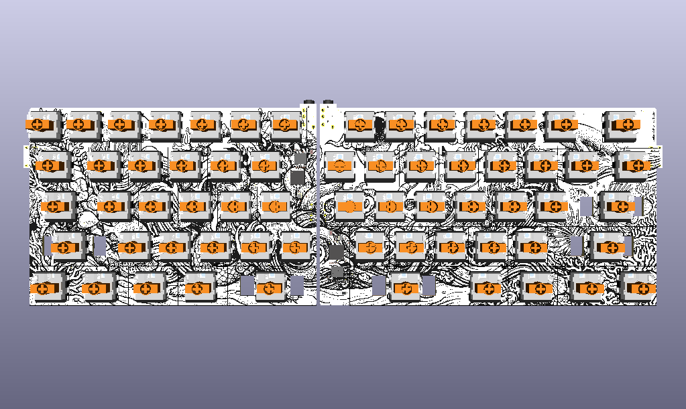
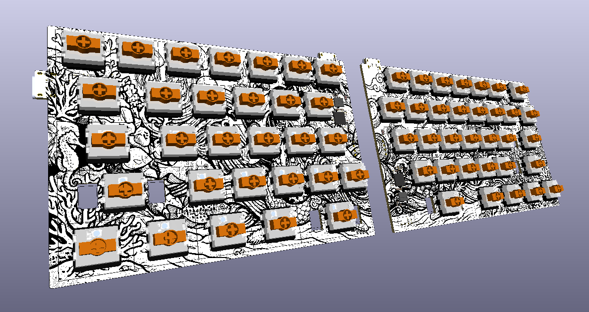
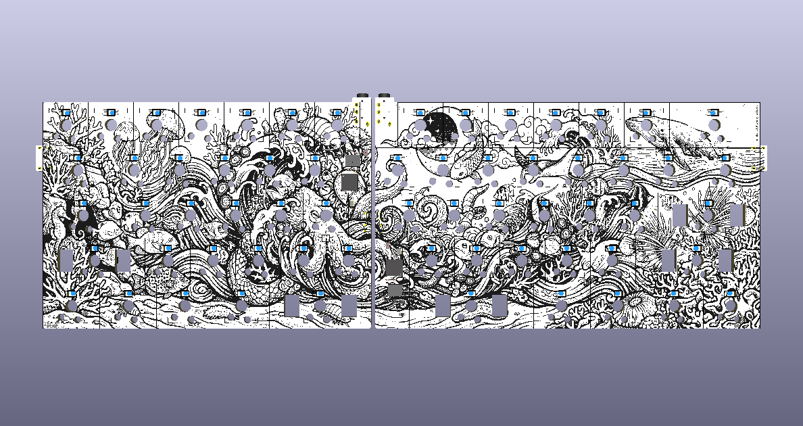
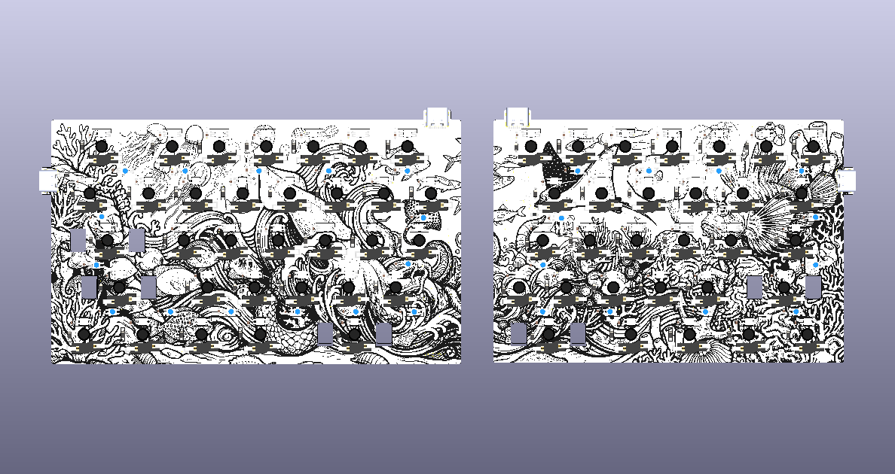
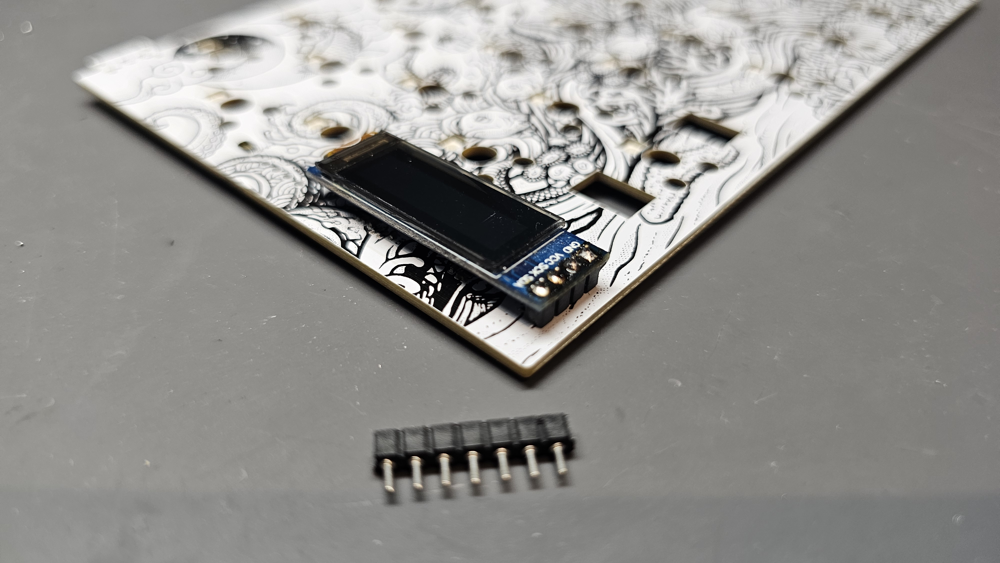
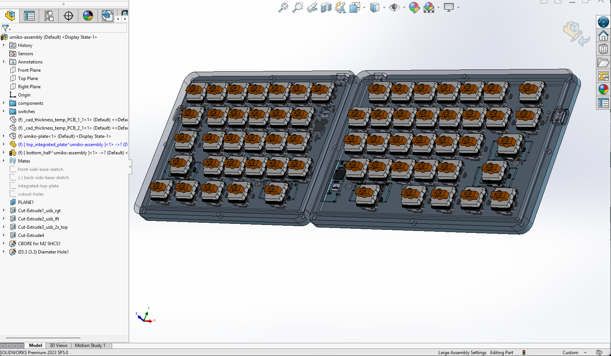
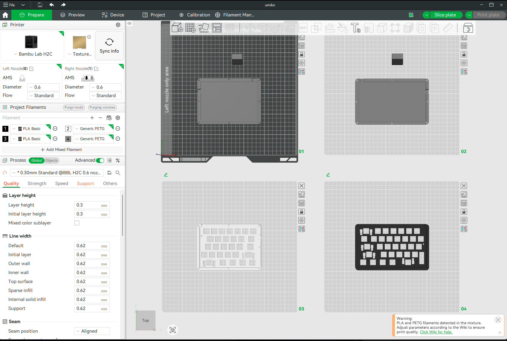
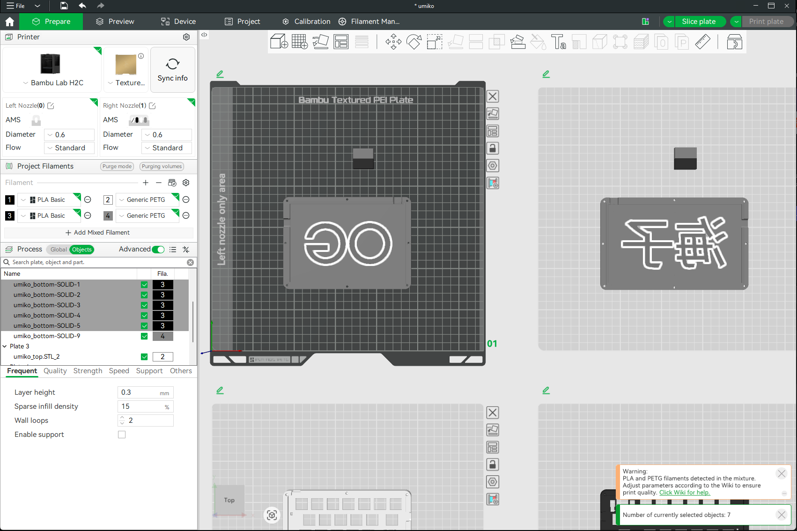
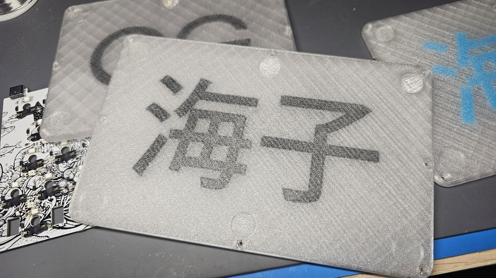

# umiko

## About

*umiko* (Japanese: **海** sea + **子** an affectionate diminutive) is a split, low-profile TKL F-row-less mechanical keyboard PCB. The split sits between your hands like the trough between two waves; typed at speed on Gateron KS-33 low-profile blues, the rolling clicks sound like waves breaking on sand.



## Features

* **Split layout** — two independent halves, each with its own MCU
* **TKL, no F-row** — full alpha + nav cluster on the right
* **Per-key RGB** — SK6812MINI-E reverse-mount, shines through PCB cutouts up into the keycap
* **Underglow** — SK6812MINI-E on the back of each PCB
* **Gateron KS-33 v2.0 low-profile hot-swap** switches (MX-compatible footprint)
* **Kailh Choc V2 stabilizers** (cutouts sized for Choc V2, not MX)
* **Host USB-C** on the outer edge of each half
* **Inter-half USB-C** on the top edge of each half. Carries single-wire PIO serial on D+, GND, and 5 V bridge
* **RP2040** with external QSPI flash (W25Q128) and 3.3 V LDO (LP5907) per half
* **BOOTSEL-only flashing** — dedicated SW1 (left) / SW2 (right); no reset circuit
* **SWD test points** — 8 pads per half in a pogo-clip pattern (CLK/IO/GND/3V3), mirrored so a flipped clip lands on matching signals
* **4-layer PCB** with split L/R rails: F.Cu signal, In1.Cu 3V3 planes, In2.Cu GND planes, B.Cu signal
* **QMK firmware**

## Hardware Specs

| | |
|--|--|
| **Dimensions** | 328.62 × 102.85 mm (end-to-end, both halves + 13.11 mm inter-half gap). Left half 145.67 × 102.85 mm, right half 169.84 × 102.85 mm. |
| **MCU** | 2× Raspberry Pi RP2040 (QFN-56) |
| **Flash** | 2× Winbond W25Q128JVPIQ (16 MB QSPI) |
| **LDO** | 2× TI LP5907SNX-3.3 (XDFN-4, 250 mA) |
| **Crystal** | 2× 12 MHz (Crystal_SMD_2520-4Pin) |
| **Switches** | 63× Gateron KS-33 v2.0 low-profile (MX-compatible, hot-swap) |
| **Stabilizers** | Kailh Choc V2 (2.25U + 2.75U + 2U backspace) |
| **RGB LEDs** | 63× per-key + 27× underglow (both SK6812MINI-E) |
| **Host USB-C** | 2× HRO TYPE-C-31-M-12, outer edge (4 mm plank + 1 mm connector overhang) |
| **Inter-half USB-C** | 2× HRO TYPE-C-31-M-12, top edge. Carries VBUS (+5 V bridge), GND, and single-wire PIO serial on D+ |
| **Case hardware** | M2 × L3 × D3.5 heat-set inserts (3.3 mm holes) + M2 × 4 mm screws |

Full sourcing detail in the [BOM](#bom).



## BOM

Quantities are rounded up for spares — order more than the minimum.

Part | Part number | Qty | Notes / Source
--- | --- | --- | ---
RP2040 MCU | RP2040 (QFN-56) | 2 | LCSC `C2040` / Mouser / DigiKey / direct from Raspberry Pi
QSPI Flash | Winbond W25Q128JVPIQ | 2 | LCSC `C190862` / Mouser / DigiKey
3.3V LDO | TI LP5907SNX-3.3 | 2 | LCSC `C133572` (XDFN-4, 1×1 mm) — 250 mA / 3.3 V. See [LDO history note](#ldo-history) below for why this instead of the Helios-spec'd TLV75533.
12 MHz crystal | 2520 4-pin SMD | 2 | LCSC `C2149204` / Mouser
USB-C receptacle (host + inter-half) | HRO TYPE-C-31-M-12 | 4 | LCSC `C165948` / JLC / AliExpress — same part used for all four positions (J1/J2 outer = host, J3/J4 top = inter-half)
USB ESD | USBLC6-2P6 | 2 | LCSC `C2827693` (SOT-666)
Polyfuse | Bourns MF-FSMF050X-2 (500 mA hold / 1 A trip, 0603) | 2 | LCSC `C210357` / DigiKey (per Helios reference design)
Ferrite bead | 600 Ω 0402 | 2 | LCSC `C160977`
Schottky diode | PMEG2010BELD (SOD-882) | 4 | LCSC `C552820` / DigiKey
Per-key LEDs | SK6812MINI-E (reverse mount) | 70+ | LCSC `C5149201` / AliExpress — order ~10% spare, fragile. Pin **numbers** between vendors differ but physical VDD/VSS/DIN/DOUT corners match
Underglow LEDs | SK6812MINI-E | 30+ | Same as above; same part (`C5149201`)
Switch diodes | 1N4148W (SOD-123) | 70+ | LCSC `C81598` / Mouser. Footprint `onigaku:D3_SMD_v2` is SOD-123, **not** SOD-323
Switches | Gateron KS-33 v2.0 low-profile | 63 | Keebio / Keychron / Gateron direct (hand-place; not from JLC stock)
Hot-swap sockets | Gateron KS33 hot-swap socket | 63 | Same source as switches
Stabilizers | Kailh Choc V2 (2u for 2.25U, 2.75U, and 2U keys) | 2 sets | Choc V2 — **not** MX. Kailh has EOL'd this part — stock spares while retailers still have them. See [Stabilizers](#stabilizers) for the full story.
0603 100 nF ceramic caps | CC0603KRX7R9BB104 (or equiv 0.1µF X7R) | 90+ | LCSC auto-matches — confirm prompt is benign
0402 caps (LDO bypass) | varies (see schematic) | as schematic | LCSC `C1525` / `C15525` / `C52923` etc.
0402 resistors | varies | as schematic | LCSC `C25905` (5.1k, UNI-ROYAL) / `C11702` (1k, UNI-ROYAL) / `C60490` (10k, YAGEO) / `C138021` (27R, YAGEO) / `C25900` (4.7k, UNI-ROYAL) — 10k and 27R switched from UNI-ROYAL to YAGEO after recurring JLC stock shortages on UNI-ROYAL 0402 SKUs; the R30/R31 4.7k previously carried the 5.1k `C25905` code by mistake and is now correct
BOOTSEL push button | 4×4×1.5 mm SMD | 2 | LCSC `C589221`
0402 status LEDs | red / blue / green (per spec) | 4 | LCSC `C130719` / `C130724`
Case heat-set inserts | M2 × L3 × D3.5 brass knurled | as case dictates | Ruthex-style or equivalent — Amazon / AliExpress. Print 3.3 mm holes; heat-install with soldering iron ~200°C
Case screws | M2 × 4 mm machine screws | same qty as heat-set inserts | Any standard M2 × 4 — hardware store / Amazon / AliExpress
Rubber feet (sticky) | Adhesive-backed rubber pads | 4–8 per half | Sized to fit the recesses on the case bottom. Any standard "keyboard foot" or "furniture bumper" pack works — Amazon / AliExpress

## Software (QMK)

### Where the keyboard config lives

Use a **fresh clone of upstream QMK** — not the older `idorurez/qmk_firmware` fork (that carries stale history for an unrelated board):

```
git clone --depth 1 https://github.com/qmk/qmk_firmware.git ~/dev/keyboard/qmk_umiko
cd ~/dev/keyboard/qmk_umiko
git submodule update --init --recursive   # ~2 GB, ~10 min. Required for RP2040 (pico-sdk)
```

The `keyboards/umiko/` folder is authored by hand here: `keyboard.json` (matrix pins, 5×8 matrix, split serial on GP0, LAYOUT_all with 63 keys), `rules.mk`, `config.h`, `keymaps/default/keymap.c`, `readme.md`. Copy these into `qmk_umiko/keyboards/umiko/` after cloning. (TODO: move this folder into the repo and use QMK's external-keyboard support so it lives next to the PCB source.)

### Toolchain (Windows)

QMK's CLI requires MSYS2 on Windows (its `MSYSTEM` environment check hard-fails in git-bash or plain shells).

**One-time setup**: [docs/toolchain-windows.md](docs/toolchain-windows.md) — exact MSYS2 install, pacman packages, QMK CLI pip, junction. Covers the Windows gotchas the QMK docs miss (jsonschema/rpds-py, `USERPROFILE`, `keyboard.json` vs `info.json`).

**Compile** (after setup):

| Script | What it does |
|---|---|
| `scripts/qmk_compile.sh [keymap]` | Wraps `qmk compile -kb umiko -km <keymap>` inside MSYS2 with all the required env vars (USERPROFILE, HOME, PATH). Defaults to `default` keymap. Output UF2 lands at `qmk_umiko/umiko_default.uf2` (~74 KB). |

### QMK config: `keyboard.json` (NOT `info.json`)

Current QMK expects each keyboard folder to have `keyboard.json` at the top level (the old `info.json` name causes `qmk compile -kb umiko` to fail with `invalid keyboard_folder value`). Umiko's config is at `qmk_umiko/keyboards/umiko/keyboard.json`.

### Split handedness

**`EE_HANDS` + `SPLIT_USB_DETECT`.** Each half's EEPROM stores which side it is; USB-detect picks master at boot. Either side can be the host.

The trade: first-time setup requires writing the handedness marker into each half's EEPROM. Options:

* Build two variants and flash the matching UF2 to each half (`qmk flash --bootloader uf2-split-left` / `-right`).
* Or flash the same UF2 on both halves, then use a key combo / `qmk` CLI to write handedness per side (one-time).

Until handedness is set, both halves default to "left" and the right side won't enumerate correctly when plugged in as master.

### Flash

Each half flashes independently via BOOTSEL:

1. **Unplug USB** from the half you want to flash
2. **Hold BOOTSEL** (SW1 left, SW2 right)
3. **Plug USB back in** while still holding
4. **Release** — the half mounts as `RPI-RP2` (USB mass-storage)
5. **Drag-and-drop the `.uf2`** onto the drive; it auto-reboots into the new firmware

First plug-in enters BOOTSEL automatically because the W25Q128 flash arrives blank from JLC. After the first flash, subsequent re-flashes need the button held.

No reset button on the board — power-cycle + BOOTSEL covers all flashing. Case access to SW1/SW2 is up to the case (v1 uses pinholes; v2 plans an integrated button — see [Rev 2 ideas](#stretch--future-ideas-rev-2)).

### Remap keys with VIA (optional)

**You don't have to do this.** The compiled default keymap works out of the box — tap-dance grave/esc, F-row on the number row via FN, arrows on the left hand via FN, RGB controls on the right hand via FN, Ctrl+Win+Left/Right for prev/next desktop on FN+[/]. VIA is only for changing those bindings **live in a browser** without recompiling.

The default UF2 already has VIA compiled in. To use it:

1. Flash `qmk_umiko/umiko_default.uf2` as usual.
2. Open **https://usevia.app** in Chrome or Edge (Firefox works but has limited WebHID).
3. Click the **gear icon** (top right) → **Settings** → toggle **Show Design tab**.
4. In the new **Design** tab, click **Load** and pick `qmk_umiko/keyboards/umiko/umiko_via.json`.
5. Switch to the **Configure** tab. Plug in the keyboard (master half) and it should appear — click it, then remap keys by clicking a position and picking a new keycode.

Changes save to the keyboard's EEPROM immediately and persist across unplug/replug and power-cycle. If you ever want to wipe your remaps and reload the compiled defaults, use **Settings → Reset Keyboard** inside VIA.

**Two things VIA can't change** (they stay hardwired in the firmware):
- The **tap-dance grave/esc** definition itself — VIA sees it as a custom keycode `TD_GRV_ESC` you can move around or remove, but not redefine.
- The **water OLED animation** — that's separate C code, unrelated to keymaps.

### Clearing EEPROM (when new defaults don't take effect)

**What EEPROM is:** a tiny chunk of persistent storage on the keyboard's chip. It survives power-cycles and even reflashing new firmware — that's the whole point of it.

**What it stores:**
- Current RGB color, saturation, brightness, animation mode
- Any key remaps you've made in VIA
- Some firmware-level settings

**Why you'd clear it:** If you flash new firmware with different default colors, a different startup animation, or a new default keymap, **the new defaults won't take effect** on their own — the keyboard reads its saved state from EEPROM first and only falls back to the compiled defaults when EEPROM is empty. So the classic "I flashed a new firmware and it still looks/behaves the same as before" is almost always this. Clear EEPROM once and the compiled defaults apply.

**How to clear it** (bootmagic — no browser needed):

1. Unplug the master half's USB
2. **Hold** the top-left key (grave/escape position — this is matrix `[0,0]`, wired to bootmagic)
3. **Plug USB in** while still holding
4. Release after ~1 second

Next boot uses whatever the compiled firmware defines as defaults.

**Alternative** (if you already have VIA loaded): VIA → gear icon → `Reset Keyboard`. Same result.

### Default keymap

Two layers: `_BASE` (0) and `_FN` (1). Layer state is synced across the split so the OLED's layer indicator updates when the master fires an `MO(_FN)`.

**Base thumb rows:**

* Left: `LCTL, LGUI, LALT, MO(_FN), SPC`
* Right: `SPC, MO(_FN), RALT, RGUI, RCTL`

**Special base keys:**

| Position | Base behavior |
|---|---|
| Top-left | **Tap dance** — single tap = `` ` `` (grave/tilde), double tap = `Esc` |
| Caps position | `MO(_FN)` — third FN trigger (also functions as a caps position by not doing caps at all; use `FN + Backspace` if you need Caps state — see FN layer) |
| Number row (right of `=`) | `Backspace` |
| QWERTY row (right of `]`) | `Backslash` (`\`) |

**FN layer** (hold any `MO(_FN)`):

| Group | Keys |
|---|---|
| Reset | `Esc` → `QK_BOOT` |
| F-row | `1..6` → `F1..F6`, `7..0, -, =` → `F7..F12` |
| Nav (left hand) | `Q W E R` → `HOME UP END PGUP`; `A S D F` → `LEFT DOWN RIGHT PGDN` |
| Delete | `FN + Backslash` → `Delete` |
| Virtual desktop | `[` → `Ctrl+Win+Left` (prev desktop); `]` → `Ctrl+Win+Right` (next) |
| Underglow | `Y U I O P` → `TOG NEXT HUE+ SAT+ VAL+ SPD+`; `H J K L ;` → `PREV HUE- SAT- VAL- SPD-`; `N` → toggle on/off |

Everything else on FN is transparent (falls through to base).

### OLED animation

The right-side 0.91" SSD1306 (128×32) is rotated to portrait (32×128) via `OLED_ROTATION_270`. The scene is a diver's-eye view of a reef with a live-swimming fish, a bobbing silhouette fish, and rising bubbles. Frame rate scales with WPM: ~7 fps idle, up to ~25 fps at fast typing.

**Composition (top → bottom):**

* Row 0 (pixel y=0-7): master/slave + layer indicator (`M L0` / `S L0`)
* Backdrop: pre-baked 32×128 reef bitmap in `PROGMEM` (512 bytes) — dense line art of coral, waves, and small creatures
* Overlay 1: **bobbing silhouette fish** — the 11×6 sprite is the exact pixels lifted from the source PNG at (7,73)..(17,78), with the corresponding bitmap cells zeroed so the sprite can drift vertically without leaving residue
* Overlay 2: **small swimming fish** — 5×3 body + wiggling tail, patrols left→right in the empty water below the text
* Overlay 3: **rising bubbles** — 1-pixel bubbles spawn near y=40 (just above the reef top), rise up to y=18 and pop at the surface. Up to 4 alive at a time, deterministic xorshift PRNG picks x and spawn cadence.

**How the reef bitmap is made** (workflow for regenerating from a new source):

1. Start with any black-and-white line-art PNG. Portrait aspect ratio works best; 32×128 already-sized skips a step.
2. Resize/threshold to 32×128 1-bit (Pillow: `im.convert("L").point(lambda p: 255 if p >= T else 0, mode="1")`). Threshold ≈145 gave the best balance of coral silhouette vs negative space.
3. Pack row-major, 4 bytes per row (LSB = leftmost column), into a `static const uint8_t reef_bitmap[128 * 4] PROGMEM = { ... }` array.
4. Paste into `keymaps/default/keymap.c` replacing the existing table.

If you extract a new silhouette to animate (like the fish), also zero the corresponding bitmap bits so the backdrop doesn't double up on the moving sprite.

### Underglow-only RGB (per-key LEDs held dark)

Each half's LED chain interleaves per-key LEDs with underglow LEDs (both `SK6812MINI-E`, wired in one chain per side). Chain layout:

* Left: local 0..11 = underglow (12 LEDs), 12..41 = per-key (30 LEDs)
* Right: local 0..14 = underglow (15 LEDs), 15..47 = per-key (33 LEDs)

Only the underglow should show animation, so the compiled default forces per-key positions to `HSV_OFF` via `RGBLIGHT_LAYERS`. Two layers are defined — one for each master case (left-master vs right-master) — because the global-index → local-LED mapping shifts with handedness. `keyboard_post_init_user` enables the appropriate layer based on `is_keyboard_master()` and `is_keyboard_left()`.

Base animation is `snake` (a moving band chases through each half's underglow) in a deep Prussian-blue Kanagawa hue (H=150, S=190, V=60). Cycle animations via `FN + Y` (next) / `FN + H` (prev); adjust hue/sat/val/speed via the other FN + right-hand keys.

Note: `EE_HANDS` handedness setup is required for the underglow layer to target the correct LEDs when either side is master — see [Split handedness](#split-handedness).

### Split serial: what's on the wire

QMK's split transport runs over **single-wire half-duplex PIO serial** on **GP0** of each RP2040. GP0 connects to the D+ pin of each half's inter-half USB-C (J3 left, J4 right). A short USB-C-to-USB-C cable between J3 and J4 ties the GP0 lines together and bridges 5 V (VBUS pins A4/A9) and GND (A12/B12).

QMK config:
- `keyboard.json` → `split.serial.driver = "vendor"` (RP2040 PIO peripheral)
- `config.h` → `SERIAL_USART_TX_PIN = GP0` (same pin for TX and RX, half-duplex)

The inter-half USB-C is **not** a real USB port — just a convenient 4-conductor shape carrying VBUS + GND + D+. **Never plug J3 or J4 into a computer or USB device.**

## Assembly Notes



> ⚠️ **Hand-solder only the DNP parts. Get everything else JLCPCB-assembled.**
>
> **✅ Reasonable to hand-solder** (these are DNP'd for exactly this reason):
> * **SK6812MINI-E LEDs** — per-key (reverse-mount) and underglow. Fragile, tedious, doable with flux and patience.
> * **Gateron KS33 hot-swap sockets** — pre-tin pads, place, reflow one pad at a time.
> * **HRO TYPE-C-31-M-12 USB-C** — through-hole shield legs + reflowable SMD data pads. Manageable with a chisel tip.
>
> **❌ Do NOT hand-solder** (unless you have reflow / hotplate / hot-air):
> * **RP2040 (QFN-56)** — exposed thermal pad, needs bottom heat. Easy to kill a $30 chip.
> * **LP5907 (XDFN-4, 1×1 mm)** and **SN74LVC1T45 (SOT-563)** — pads barely visible without magnification.
> * **W25Q128 (WSON8)** — exposed pad on the bottom.
> * **USBLC6-2P6 (SOT-666)**, **PMEG2010BELD Schottky (SOD-882)** — sub-mm pitch.
> * **0402 passives, matrix diodes (SOD-123), crystal (SMD-2520)** — 90+ tiny caps alone.
>
> Get JLCPCB to place the "do NOT" list via SMT assembly (see [Manufacturing Notes](#manufacturing-notes-jlcpcb)). Do the ✅ list yourself when the boards come back.
>
> The Soldering Order / Hints / LEDs / Stabilizers sections below cover that hand-solder pass.

### Soldering Order

1. **Smallest first** — 0402 resistors/caps, then 0603, then SMD ICs
2. **RP2040** — exposed thermal pad on the bottom needs bottom heat (hotplate / reflow). Fine-tip hand-soldering is doable but tricky.
3. **Flash, LDOs, ESD protection** — small SMD work
4. **Crystals** — fragile; place after nearby heavy soldering is done
5. **USB-C receptacles** — SMD signal pads + 4 THT shield legs + 2 NPTH alignment pegs. Reflow or hand-solder.
6. **LEDs** — underglow first (back), then per-key (front). Test as you go.
7. **Hot-swap sockets** — leave for last so nothing gets in the way of earlier soldering
8. **Stabilizers** — clip in before testing switches
9. **Switches** — after firmware flashes successfully

### Soldering Hints

* 0402 / 0603 pads: **flux liberally**, keep your tip tinned with a fine bead
* Hot-swap sockets: **pre-tin both pads**, place, reheat one pad at a time while pressing down
* RP2040 thermal pad: **use the via stitching as a heat sink** — paste + hot air, or paste + skillet reflow

### LEDs



* Underglow LEDs are **reverse-mounted on B.Cu** — pads on B.Cu, body below the PCB. **Bend the terminals down to the pads** before soldering.
* **Solder in chain order and test as you go** — a bad LED kills every LED downstream of it.
* An LED that looks melted probably is. Desolder and replace.

### Stabilizers

**Kailh Choc V2 stabilizers** on all 6 stabbed positions (2.25U shifts + 2.75U thumbs + 2U backspace). MX stabs won't fit. Kailh **EOL'd this part in 2026** — stock spares while retailers still have them.

**Not Gateron LP.** Per bakingpy (Keebio, author of `keebio/kb-plategen`): LP stabs mechanically limit switch travel so keys don't bottom out; no cutout tweak fixes it.

**Plate design**: 2.2 mm plate with a stepped pocket per stab (1.2 mm housing on top, 1.0 mm wire clearance on bottom). Reference: [`reference/choc_v2_stab_holder.stl`](reference/choc_v2_stab_holder.stl). **PETG needs no tolerance tuning.** Other FDM materials may need outward relief on the far-from-switch faces (never widen inward — plate breaks during install).

Cutout dimensions (from `keebio/kb-plategen`, encoded in `scripts/make_plate.py`): Body A 5.95×7.95 mm at (±12, ±0.3441), Neck B 4.55×6.25 mm at (±12, ±6.7559), Wire slot 24×1.4 mm at (0, ±8.2809), r=0.5 mm fillet. Sign flips for SW_30/SW_35 (bottom-edge keys → wire points north).

### OLED (optional: socketed mount)

**Optional.** Direct-soldering the OLED works fine. This section is for when you want it **removable** — swap, replace, or lift the top plate without desoldering.

Use low-profile Mill-Max pins + receptacles instead of 0.1" headers. The receptacle stays **under the 2.2 mm plate height**, so it doesn't foul plate mounting.

**Parts**:

| Description | Manufacturer PN | Source |
|---|---|---|
| PC pin, circular 0.020" DIA gold — one per OLED pin (typically 4) | Mill-Max `3320-0-00-15-00-00-03-0` | [Digi-Key `ED1134-ND`](https://www.digikey.com/en/products/result?keywords=ED1134-ND) |
| Receptacle strip 64-pos, 0.1" pitch gold — snap off / trim to your pin count | Mill-Max `315-47-164-41-001000` | [Digi-Key `ED11182-ND`](https://www.digikey.com/en/products/result?keywords=ED11182-ND) |

**Assembly**:

1. Cut the 64-pos receptacle strip down to match your OLED pin count (usually 4 pins for a standard SSD1306 module: GND, VCC, SDA, SCL).
2. Solder the receptacle strip into the OLED footprint on the PCB.
3. Insert the Mill-Max pins into the OLED module (from the top side), then solder them from the bottom of the OLED PCB.
4. Plug the OLED (with pins attached) into the receptacles on the main board.




### SWD Debug

Rarely needed — BOOTSEL covers most flashing. If you do need SWD:

* TP1-TP4: SWD signals (left CLK/IO, right CLK/IO)
* TP5-TP8: power references (GND_L, 3V3_L, GND_R, 3V3_R)
* All 8 pads in two mirrored 4-pad columns at 2.54 mm pitch (Adafruit pogo-clip 5433 compatible)
* Left order top-to-bottom: **CLK / IO / GND / 3V3**
* Right order (mirrored): **3V3 / GND / IO / CLK** — a flipped pogo clip lands on matching signals

## Manufacturing Notes (JLCPCB)

### Cost reference

Two reference points from actual orders:

* **First-time full-panel build** (both halves per board, 5-board fab minimum with parts placed on 3 = 3 assembled + 2 bare spares): **~$489**
* **Right-half-only re-order** (170 × 103 mm single-half, 5-board fab minimum with parts on 3): **~$300**

A first-time builder needs the full-panel order (~$489). The single-half re-order was cheaper because I already had working left halves from the first fab and only needed the right half re-made with a schematic fix.

Rough breakdown:

* PCB fab (5 pcs, 4-layer, full-panel or half): ~$50–100
* PCBA labor + parts sourcing (3 boards): ~$200–300
* Express shipping to US: ~$80
* Customs / import handling: ~$50–100

5 assembled vs 3 usually adds only ~$50–100 total — setup and per-part sourcing fees amortize. If you want spares, 5 fully assembled is barely more per board than 3.

### Design rule clearances

Set up for **JLCPCB's standard 4-layer tier** (no surcharge):

* **Minimum clearance**: 0.1 mm (4 mil)
* **Net class clearance**: 0.1 mm
* **Track widths**: 0.2 mm signals, 0.3 mm power/GND — well above the minimum
* **Min via**: 0.4 mm / 0.2 mm drill
* **Min hole**: 0.3 mm

Tighter clearances (down to 0.089 mm / 3.5 mil) are accepted but incur a **+20% surcharge** on 4–8 layer boards.

### JLC fab options used for this design

* **Layers**: 4
* **Different Design in Panel**: 2 (left and right halves are separate outlines)
* **Min hole size**: 0.3 mm
* **Min track/spacing**: 5/5 mil (well within standard)
* **Outer copper**: 1 oz
* **Inner copper**: 0.5 oz (default for 4-layer)

### Fab file generation

| Script | What it does |
|---|---|
| `scripts/make_jlc_files.py` | Reads the schematic + PCB (read-only) and writes 3 JLC-upload-ready files to `fab/`: gerbers zip, BOM CSV, CPL CSV — all in JLC's exact required format (specific headers, 4-decimal mm-suffixed coords, integer rotations, DNP filter, LCSC overrides). Regenerate any time. |

Outputs in `fab/`:

| File | Purpose |
|---|---|
| `umiko-jlc-gerbers.zip` | Gerbers + Excellon drill files — the fab upload |
| `umiko-bom-jlc.csv` | BOM in JLC format (header uses fullwidth Chinese parens; ref ranges expanded; DNP rows filtered out) |
| `umiko-cpl.csv` | Placement (Designator, Mid X/Y with `mm` suffix at 4-decimal precision, capitalized Top/Bottom, integer rotation 0–359) |

**DNP list** (excluded from both BOM and CPL — hand-soldered later):

* `YS-SK6812MINI-E` (90 total) — per-key are reverse-mount (not standard PnP); underglow OPSCO layout is 180° from our footprint. Both hand-soldered.
* `KEYSW` (63) — Gateron KS-33 hot-swap sockets, not in JLC's stock. Sourced from Keebio / Gateron / AliExpress.

**LCSC overrides** (baked into the script for parts whose schematic symbols don't carry an LCSC field): matrix diode `D3_SMD_v2` → `C81598`, per-key + underglow LED `YS-SK6812MINI-E` → `C5149201`.

### CAD exports (case / plate design)

| Script | What it does |
|---|---|
| `scripts/make_cad_files.py` | 3D STEP exports of the whole board + component groups (assembly, halves, switches, LEDs, ICs, connectors, passives) for case CAD import into SolidWorks. Read-only on the source PCB — uses an in-memory copy + self-deleting temp file. |
| `scripts/make_plate.py` | Plate STEP + DXF for the case top plate (integrated switch cutouts + Choc V2 stab cutouts). Optional CLI arg to also generate a "switches-only" alt plate with configurable switch cutout size (`14.2 14.0` recommended for FDM). Read-only on the source PCB. |

Outputs in `cad/`:

| File | Purpose |
|---|---|
| `umiko-assembly.step` | Full board + all components |
| `umiko-half-{left,right}.step` | Split into just one half |
| `umiko-{switches,leds,ics,connectors,passives,board}.step` | Component-group subsets |
| `umiko-plate.step` / `.dxf` | Plate with switch + stab cutouts (canonical Choc V2 spec) |
| `umiko-switches-only[-WxH].step` / `.dxf` | Alt plate with just switch cutouts at custom size |

**Key numbers**:

* **Board thickness**: 1.6 mm (JLC standard, ±10% — plan case pocket for up to 1.76 mm)
* **Plate thickness**: **2.2 mm total** (bakingpy two-level) — 1.2 mm housing pocket on top + 1.0 mm wire clearance on bottom (see [Stabilizers](#stabilizers))
* **Switch bodies render on F.Cu, hot-swap sockets on B.Cu.** Footprints live on B.Cu (where the socket pads are), but the switch body still shows on F.Cu.
* **STEP thickness compensation**: KiCad's exporter omits outer copper (~0.07 mm) + soldermask (~0.02 mm), so both scripts add **+0.09 mm** to hit true 1.6 mm / 1.2 mm. F.Cu components ride up automatically; switch bodies (anchored to B.Cu sockets) get a `-4.1 → -4.19` 3D-model nudge to stay flush.
* **PLA case FDM clearance**: **0.5 mm/side long axis, 0.3 mm/side short axis, 0.2 mm Z**. Print tolerance dominates PLA shrinkage / thermal. Test a corner chunk and tune slicer XY size compensation before a full-case print.



#### Sample print (Bambu Lab)

A sliced Bambu Lab project file is included at [`cad/print/umiko.3mf`](cad/print/umiko.3mf), with `umiko_top.STL` and `umiko_bottom.STL` alongside it. Covers top and bottom plates for both halves.

The bottom plate is designed for a **transparency-color layer sandwich**: the embedded Umiko kanji (海子) prints in your color of choice, sandwiched inside transparent PETG for the branding effect.

**Filament note:** PETG for the outer transparent shell works reliably. For the embedded kanji layer, PETG is safest — some PLA brands don't fully adhere to PETG at the interface, so portions of the embedded logo may separate and give a splotchy look. If you want to use PLA for the kanji, test-print a small sample with your specific filament brand first.





#### Workflow suggestion (case design)

The included case design is complete — this workflow is only if you want to build your own (or use the included one as a starting point).

1. Run `python scripts/make_cad_files.py` and `python scripts/make_plate.py` once to seed `cad/` with the STEPs.
2. In SolidWorks, import `umiko-assembly.step` (or per-half) as reference geometry and mate to case origin.
3. Design the case around it — pocket the PCB, add USB-C cutouts, screw holes, feet, BOOTSEL access at SW1 (166.01, 57.53) and SW2 (188.17, 77.52). v1 uses pinholes; v2 plans an integrated button — see [Rev 2 ideas](#stretch--future-ideas-rev-2).
4. Plate: import `umiko-plate.step`, or build a subtract body from `umiko-switches-only.step` (SolidWorks "Combine → Subtract").
5. Freeze the STEPs once case work starts — see warning below.
6. Track your working SW files under `cad/` in git — everything else there is regenerable.

> ⚠️ **Don't re-import STEPs into an active case assembly.**
>
> A PCB change → fresh STEP export → re-import into your existing SolidWorks case will almost certainly **break downstream in-context references.** Sketches that used Convert Entities on imported edges show as dangling; dependent features fail; SW 2023's "Repair Dangling Reference" doesn't reliably help. Cause: STEP entity IDs shift on every recompile, and SW references are ID-based.
>
> **Rule of thumb**: only re-run the scripts when the PCB actually changes AND you need the case CAD to reflect it visually. A slightly stale reference PCB in your case model saves hours of repair. The fab side is unaffected — `scripts/make_jlc_files.py` reads the current PCB directly.
>
> **If you must re-import, isolate.** `make_cad_files.py` writes per-group STEPs (`umiko-switches.step`, `umiko-leds.step`, `umiko-connectors.step`, `umiko-ics.step`, `umiko-passives.step`, `umiko-board.step`). Swap only the subset your change touched — re-import just `umiko-switches.step` if you moved a switch, not the whole assembly. Damage stays contained. And work on a **copy** of the case first as a safety net.

### Pre-fab sanity gate (catches the "forgot to save to disk" short)

We shipped a short once because the GUI DRC looked clean but the disk file wasn't. The gate below prevents that.

**Field rework (this build):** 2 boards saved by cutting the short at B.Cu (~322, 55) — fully functional after the cut. 3rd board: same cut + burned Schottky, F2 (D5) jumpered — works for testing but has **no reverse-polarity protection on J2**, so replace D5 (PMEG2010BELD) before daily use.

Before you export:

1.  **Fresh open/close before export.** Close KiCad, reopen the project, `Edit → Fill All Zones` (`B` in the PCB editor) to force on-disk fills to match the display. Save. Skipping this lets GUI DRC lie.
2.  **Run the CLI gate: `scripts/prefab_check.sh`** (added in `d164d0c`).

    ```bash
    scripts/prefab_check.sh            # checks umiko.kicad_pcb
    scripts/prefab_check.sh path/to/other.kicad_pcb
    ```

    Uses `kicad-cli` directly (no GUI cache) to `--refill-zones`, `--save-board`, then DRC with `--severity-error --exit-code-violations --format json --output output/prefab_drc.json`. Exit 0 = safe to fab. Non-zero = fix first. On Windows the default CLI path is `C:/Program Files/KiCad/10.0/bin/kicad-cli.exe` — edit the script if yours is elsewhere.

3.  Only after the gate passes: run `scripts/make_jlc_files.py` and upload.

### JLC upload gotcha

**Updates to BOM or CPL won't apply unless you restart the upload from the project menu.** Re-uploading just the changed file after a failed attempt appears to succeed but JLC keeps the prior validation state, giving errors like "Failed processing the CPL file" or "BOM doesn't match CPL" that don't match the current files. Fix: back up to the **PCB quote** step and restart the whole upload (gerbers → BOM → CPL).

### CPL format quirks (learned the hard way)

JLC's CPL parser is strict about:

* **Rotation must be a non-negative integer 0–359.** KiCad's default `-90.000000` is rejected. `make_jlc_files.py` normalizes with mod 360.
* **Coordinates must be fixed at 4-decimal precision** (`8.6470mm`, not `8.647045mm`). Script formats with `.4f`.
* **Headers must match JLC's sample exactly** — including the fullwidth Chinese parens in `JLCPCB Part #（optional）`.

### Polarity / pin-1 review from JLC (expect these questions)

**Always cross-check JLC's placement preview against your KiCad board before approving.** Click each flagged part in KiCad, verify pin-1 or cathode/anode matches JLC's pink-dot orientation. Don't trust LCSC codes or JLC library shorthand — their footprint convention may be opposite yours.

JLC's engineering review sends placement snapshots with a **pink dot on pin 1** of every polarized part and asks you to confirm one by one. Patterns worth banking:

* **Non-polarized parts** (polyfuses, ceramic caps, resistors, ferrite beads) — reply "no polarity, either orientation works, no correction needed." The pink dot is a manufacturing marker, not an electrical flag.
* **Polarized parts** need per-part checks: diodes (D5 Schottky), LEDs (D2/D4/D6 + every SK6812MINI-E), any electrolytics, and orientation-sensitive ICs (RP2040, LDO, USBLC6, level shifter). Compare JLC's pink-dot direction to your KiCad footprint's pin-1. If flipped 180°, request rotation.
* **Same LED footprint, different LCSC codes → opposite pin-1 conventions.** On this project D4 (`C130724`, Sunny B1811NB) uses **anode = pin 1**; D6 (`C130719`, Sunny B1811URO) uses **cathode = pin 1** — same footprint, opposite convention. D4 required 180°; D6 did not. Check each 0402 LED individually.
* **How to answer:** open the PCB, click the flagged pad, note pin-1's electrical role and which physical side it lands on after footprint rotation. Compare to JLC's snapshot. Correct side → confirm. Wrong side → request 180°. The `pinfunction` fields in `umiko.kicad_pcb` (`K_1`, `A_2`, `SDA_1`, etc.) show the intended role.

**Rotation corrections that recur** — send these with your BOM upload so engineers apply up front:

* **U10** (LP5907 LDO, X2SON-4): **+90°**
* **D5** (PMEG2010BELD Schottky, SOD-882D): **⚠️ Don't specify a rotation.** Compare D5 directly against D1 (left half, known-working from the full-panel order) in JLC's rendering and match D5's orientation to D1's. Don't reason from rotation math — B.Cu mirroring and library conventions make it ambiguous. A bad 180° request on the right-only re-order killed 3 boards.
* **J2/J4** (HRO USB-C, if their 3D preview looks backwards): **180°**
* **D4** (Sunny B1811NB User LED): **180°**
* **D6** (Sunny B1811URO Power LED): **no correction**
* **U6, U8, U9**: **270°** (documented in schematic `JLCPCB_CORRECTION`; JLC usually applies proactively)

## Design Notes


* **No reset circuit** — flashing via BOOTSEL only. RP2040's `~RUN` has an internal pull-up; floating is safe.
* **Inter-half connection** uses HRO TYPE-C-31-M-12 USB-C on the top edge, carrying QMK PIO-serial on a **single wire on D+** (A6/B6 tied, A7/B7 D− unused). VBUS (A4/A9) bridges 5 V across halves; GND (A12/B12) ties them. The 5 V bridge lets one host USB-C power both halves through Schottky OR-ing. All four USB-C connectors (J1/J2 host, J3/J4 inter-half) carry 5.1 kΩ CC1/CC2 pull-downs to GND. J3/J4 don't strictly need them (no USB protocol on the link), but they're populated so an accidentally-plugged host cable can't drive VCONN into a floating pin.
* **Inter-half data is single-wire, not differential** — D+ carries half-duplex 12 MHz PIO serial; D− is intentionally floating. Same idea as TRRS RING1 splits, just routed through USB-C-shaped pins. **Not** a real USB port; don't address it as one.
* **Connector placement** — host jacks J1/J2 on outer edges (aligned with Q-row keycap top). Inter-half jacks J3/J4 on the top edge near the inner corner, so a short USB-C cable bridges them with minimal slack. All four sit on 4 mm Edge.Cuts planks with the connector plug face overhanging the plank by 1 mm — 1 mm recess inside a planned 6 mm case wall.
* **Each half is fully independent** — power and flash each on its own. Either can be master.
* **Edge cuts** have 1.25 mm corner fillets. Both halves are closed loops; no breakaway tabs (order as 2 separate boards or a customer panel).
* The **`onigaku` sibling repo** holds the custom symbols, footprints, and 3D models. Clone it next to this repo so KiCad can find the libraries.

### LDO history

U2/U10 use **LP5907SNX-3.3** (TI, XDFN-4, LCSC `C133572`, 250 mA) — a pin-compatible substitute for the 0xCB Helios reference `TLV75533PDQNR` (X2SON-4, 500 mA, LCSC `C2861882`) after JLC/LCSC ran out of X2SON stock through 2025–2026. Same symbol and footprint; only the placed chip changed.

**250 mA is enough**: per-half 3.3 V load is ~150 mA peak (RP2040 ~50 mA + flash ~15 mA + OLED ~20 mA + LEDs/biases). Per-key RGB runs off 5 V, not this rail.

**If a future rev needs 500 mA** (Bluetooth, larger display, expansion): `TLV75533PDQNR` drops into the current footprint if JLC restocks; `TLV75533PDBVR` (SOT-23-5, LCSC `C404027`) is more reliably stocked but needs a footprint + symbol swap (5-pin: pad 5 = OUT, pad 4 = NR).

## Stretch / Future Ideas (Rev 2)

* **Case-integrated BOOTSEL button per half** — v1's tiny SMD tacts (SW1/SW2) need a case pinhole and paperclip. v2: swap to a larger through-hole tact so a printed cantilever / living-hinge button can press it from outside, or use a case-integrated button style with the tact positioned under the flexure.
* **Lower-profile OLED mounting** — the current 4-pin through-hole header puts the daughterboard 10–12 mm above the PCB, forcing the case cutout to swallow the whole board (not just the display window). Options: short-body SMD headers (~3–5 mm mated), board-to-board connectors (Hirose DF13 / JAE FI-X, 2–4 mm), or a direct SMD OLED module (eliminates the daughterboard).
* **OLED breakout board** for the inter-half I²C lines (`SCL_*` / `SDA_*` are broken out but unwired).
* **Sound** — small speaker + amp (e.g. PAM8302 mono class-D) + I²S DAC or codec on the RP2040 for short WAV/MP3 clips off SD or extra flash. Ocean/wave sample loops (fitting the name), click/keypress feedback, boot chime.

## Inspiration

This design borrows ideas from:

* [Keebio](https://keeb.io) — the entire ecosystem around Kailh Choc V2 + Gateron KS-33 low-profile builds; `keebio/kb-plategen` (canonical Choc V2 stab cutout spec), the two-level plate design shared by bakingpy, and general reference for split ergo hardware conventions
* [0xCB-Helios](https://github.com/0xCB-dev/0xCB-Helios) — schematic patterns for RP2040 + dual flash + LDO
* [0xCB-libs](https://github.com/0xCB-dev/0xCB-libs) — footprints for RP2040, W25Q128 flash (WSON8), LP5907 (X2SON-4), USB-C receptacle, SOD-882 Schottky and other small SMD parts used throughout this design

## Credits

* **Conor Burns** ([0xCB-dev](https://github.com/0xCB-dev)) — designer of the [0xCB-Helios](https://github.com/0xCB-dev/0xCB-Helios) reference board and for direct guidance on it. umiko's schematic (RP2040 + dual flash + LDO + USB-C power path) builds directly on Helios; without that reference this project wouldn't exist.
* **bakingpy (Danny) at [Keebio](https://keeb.io)** — source of the Kailh Choc V2 stab cutout spec ([`keebio/kb-plategen`](https://github.com/keebio/kb-plategen)) that `scripts/make_plate.py` implements, the recommendation to use Choc V2 over Gateron LP, and the two-level plate design shared as a printable [reference STL](reference/choc_v2_stab_holder.stl). Adopted directly; works in PETG with no tolerance tuning.
* The **QMK community** — firmware help and patience.

## License

PCB files: CERN OHL v2 — Permissive (or your preferred license; verify before forking).
Firmware: GPL-2.0 (inherited from QMK).
